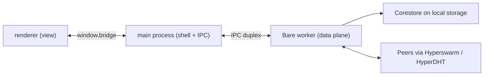

# lightchain-p2p

Peer-to-peer infrastructure for Lightchain AI, built on the Pear/Holepunch stack.

This repository holds the applications and libraries that let models, artifacts
and worker software move between machines **without a hosting account, a CDN or a
foundation-operated server in the path**. It is the implementation of the
peer-to-peer advancements described in the DAO proposal, not a rewrite of the
chain.

---

## Contents

- [What we are building](#what-we-are-building)
- [BETA status](#beta-status)
- [Architecture](#architecture)
- [Repository layout](#repository-layout)
- [Getting started](#getting-started)
- [Packaging](#packaging)
- [Driving the app: the harnesses](#driving-the-app-the-harnesses)
- [CI and release](#ci-and-release)
- [Platform support](#platform-support)
- [Testing](#testing)
- [The rules that matter](#the-rules-that-matter)
- [Decisions](#decisions)
- [Reference material](#reference-material)

---

## What we are building

The proposal defines five advancements. Three of them are built here, one is
partly here, and one is a design exercise.

| #   | Advancement                     | Lives here | What it means                                                                                                                                                                                                                                                                                                                                      |
| --- | ------------------------------- | ---------- | -------------------------------------------------------------------------------------------------------------------------------------------------------------------------------------------------------------------------------------------------------------------------------------------------------------------------------------------------- |
| 1   | Open model delivery             | Partly     | Every model becomes a Hyperdrive seeded by every worker holding it, removing the approved-model list. Note the proposal says a 32-byte key is self-certifying; in practice a reference is a key **and** a version, because a key alone names a mutable history — see [packages/drive](packages/drive). The on-chain half is in the contracts repo. |
| 2   | Worker distribution and updates | Yes        | One guided installer per OS that installs, registers, supervises and updates a worker. Collapses a nine-phase manual onboarding.                                                                                                                                                                                                                   |
| 3   | Artifact availability           | Yes        | Model archives, adapter manifests, validation reports and benchmarks on Hypercore with blind-peer replication, retrievable after the publisher goes offline.                                                                                                                                                                                       |
| 4   | The universal peer-to-peer hub  | Yes        | One chat application across desktop and terminal, sharing a single Bare core. The user's identity, history, model access, rooms and payments in one place.                                                                                                                                                                                         |
| 5   | Direct peer routing             | No         | Clients reaching workers directly over HyperDHT. Economically sensitive because worker selection determines who earns, so it needs verifiable randomness. Prototype only.                                                                                                                                                                          |

Two things are explicitly **out of scope**, and it saves time to know why.

EIP-4844 blob data availability stays exactly as it is. Blob retention is
enforced on chain by `blobRetentionPeriod >= disputeWindow + resolutionTimeout`,
it is consensus-adjacent, and nothing here touches it.

Pear does not replace the worker. The worker is Go and ships as a container
image; Bare runs JavaScript and can neither execute Go nor replace a container
runtime. Docker, Ollama, a GPU and the LCAI stake all remain requirements. This
repository removes the install-and-update problem, not the inference dependency.

---

## BETA status

The repository is mid-way through a four-sprint BETA programme. The plan of
record is [docs/BETA-PLAN.md](docs/BETA-PLAN.md) — a five-specialist audit of
the whole workspace, with every finding citing the code it came from — and the
execution sequencing is [docs/SPRINTS.md](docs/SPRINTS.md). Read those before
trusting any summary, including this one.

The audit's verdict: the engineering core — key handling, the signing boundary,
SIWE hygiene, answer verification, config validation, the CI guard wall — is
release-grade. What blocked BETA was a set of money-safety bugs, the recovery
half of the inference protocol being unwired in the client, and the
distribution layer.

Sprints 1 and 2 have landed:

- **Money-safety guards.** The confirm threshold is chain-aware (a 50 ETH send
  was getting no confirmation), spending limits apply on the main spend path
  rather than only in rooms, and a failed job submit no longer wedges the
  session or risks a worker crash.
- **The recovery half of the protocol.** Every job's lifecycle is tracked from
  submit to completion or timeout, with the refundable deadline per job; a
  timed-out job can be claimed back on chain, a wrong answer disputed, and the
  delegate allowance revoked from the Wallet panel. Dispute evidence persists
  in the encrypted transcript log, so a restart inside the dispute window no
  longer forfeits the remedy.
- **The stake is guarded.** Registering a worker stakes 50,000 LCAI on mainnet
  (5,000 on testnet) plus gas, in a transaction signed inside the worker
  container. The guard now shows the exact stake and destination registry
  before launch, probed against the live `getMinWorkerStake()` rather than a
  constant, and the registration transaction is recorded in the ledger. The
  details — overpayment is kept, gas comes out of the same balance — are in
  [docs/running-a-worker.md](docs/running-a-worker.md).
- **Finality is taken seriously.** Money moves wait for three confirmations,
  and settled ledger entries are re-validated so a reorg un-settles them rather
  than leaving a receipt for funds that went back. Lightchain reads fail over
  across a two-endpoint pool.
- **OTA hardening and diagnostics.** A failed over-the-air apply is retryable
  instead of latched, crashes are reported locally, worker output goes to a
  rotating log, and Settings can export a diagnostics bundle that never
  contains keys or transcripts.

Sprint 3 is hardening and verification: test backfill, live harness re-runs,
and a full QA pass. Sprint 4 is release execution and needs the external items
with long lead times — signing certificates and a production update channel
under a real multisig — which run in parallel and are user-owned.

Known accepted tradeoffs, stated here because they belong in the open: the
guard dialog is renderer-drawn (a compromised renderer can self-confirm), the
`pear:startWorker` allowlist is broad, and local-data keys are derived from a
fixed-sentence signature, which is phishing-sensitive. The dispatcher, relay,
disputer and blob submitter are one foundation operator, and a
wrong-but-plausible answer is not client-detectable — only equivocation is
disputable. The funding dialog and Settings say the same.

### What the numbers are

Be skeptical of anything not listed as verified. The packages are real and
proven: **~1,170 vitest tests** across the workspace, all green in CI, plus the
CDP harnesses described below, which are how the numbers like "25/25, 43/43"
were produced — manually, against mainnet, not in vitest.

| Area                                                  | State           | Notes                                                                                                                                                                       |
| ----------------------------------------------------- | --------------- | --------------------------------------------------------------------------------------------------------------------------------------------------------------------------- |
| `packages/chain`                                      | **Real**        | Six EVM chains: signing, fees, ERC-20, Multicall3, endpoint failover, the bridge, Uniswap v3 swaps                                                                          |
| `packages/wallet`                                     | **Real**        | BIP-39 phrase and passphrase, BIP-32 accounts, idle locking, a sealed local store, Keystore V3                                                                              |
| `packages/inference` + `inference-crypto`             | **Real**        | Session handshake, job lifecycle, per-frame worker-signature verification before decryption; ECDH P-256 and AES-256-GCM as the deployed workers speak it                    |
| `packages/protocol`, `room`, `drive`, `blind`, `seed` | **Real**        | Model references and manifests; multi-writer rooms with presence and attachments; publish, resolve and range-read a model drive; blind-peer registration; always-on seeding |
| `packages/worker`, `host`, `preflight`                | **Real**        | Network profiles, config validation, Docker orchestration; host probing; readiness checks with actionable remedies                                                          |
| `packages/prices`                                     | **Real**        | Chainlink feeds and one Uniswap pool, read from the chain rather than an API                                                                                                |
| `packages/safety`, `ui`, `testkit`                    | **Real**        | Refusal-list decisions; design tokens held to WCAG contrast; the two-machine harness                                                                                        |
| `apps/chat`                                           | **Real**        | Rooms, a six-chain wallet, paid inference with refunds and disputes, swaps, the bridge, worker hosting, OTA updates                                                         |
| `apps/supervisor`                                     | **Real**        | Full worker lifecycle as a self-contained binary, contract addresses read from the registry                                                                                 |
| `apps/seeder`                                         | **Real**        | Always-on seeding; verified holding a real Pear-staged release                                                                                                              |
| Code signing                                          | **Not started** | Longest external lead time; blocks release on four platforms                                                                                                                |
| Blind peer fleet                                      | **Not started** | The code is tested against a real server with every holder offline; what does not exist is a machine running one                                                            |
| iOS, Android                                          | **Deferred**    | By decision — see [ADR 0001](docs/decisions/0001-defer-mobile.md)                                                                                                           |

One placeholder in `apps/supervisor` will bite you if you assume otherwise: its
Bare worker is still `hello-pear-worker`, the template's, required verbatim by
`workers/main.js`.

Both apps' `upgrade` links are their own now, and `scripts/check-links.mjs`
fails the build if two apps ever share one again — a link is an update channel,
so a shared link means staging either pushes it to the other's installs. Both
links are still development ones, whose secret keys sit on a single machine; a
release needs one under the multisig policy.

---

## Architecture

Three processes, one rule of thumb: **main is a shell, the worker is the data
plane, the renderer is a view.**



Deciding which side code belongs on is usually easy: anything touching peers,
storage or cryptography is worker code, and anything touching a screen, keyboard
or window is UI code. If it could run unchanged behind a terminal UI, it is
worker code.

The renderer runs sandboxed and **cannot load native addons at all**, so
Hypercore, Hyperswarm and sodium-native could not live there even if that were
wanted. The signing boundary follows from the same rule: keys live in the
worker, the renderer sends intents, and the worker builds the transaction,
reports exactly what it built, and only then offers to sign it.

This is also why one team can credibly target five platforms. Nearly nothing is
platform-specific — the peer-to-peer logic, protocol logic and cryptography all
live in a Bare worker that embeds identically everywhere. Only the shell differs.

Where the money paths run: swaps go through a single thin Uniswap v3 pool on
Ethereum (canonical SwapRouter02/QuoterV2, quotes via `eth_call`, the plan
re-derived at send), and the bridge is a Hyperlane warp route between ETH and
LCAI. Contract addresses are not hardcoded: they resolve live from the
`WorkerRegistry` predeploy, and the worker container is given
`AI_CONFIG_ADDRESS` for the AIConfig **proxy** (`0x24D1…Ce77D`). The
`0x2e832E…D402` address in the [public contract
docs](https://docs.lightchain.ai/docs/getting-started/mainnet/contracts) is the
implementation, not the proxy — sending the container the implementation is the
kind of thing that only fails at registration time.

---

## Repository layout

```
apps/
  chat/              Electron + Bare P2P app: chat, wallet, swaps, bridge,
                     paid inference, worker hosting
  supervisor/        Bare terminal app: installs, supervises, updates a worker
  seeder/            Always-on seeding for staged releases
packages/
  chain/             Six EVM chains: signing, fees, ERC-20, the bridge, swaps
  wallet/            BIP-39/32, Keystore V3, sealed store, idle locking
  inference/         Session handshake, job lifecycle, verification, disputes
  inference-crypto/  ECDH P-256 + AES-256-GCM as deployed workers speak it
  protocol/          Model references, manifests, room entries, resolution
  room/              Multi-writer rooms, presence, attachments
  drive/             Publish, resolve and range-read a model drive
  blind/             Blind-peer registration
  seed/              Holds and serves drives
  host/              Probes the machine a worker would run on
  preflight/         Host readiness checks with remedies
  worker/            Network profiles, config validation, Docker orchestration
  prices/            Chainlink feeds and one Uniswap pool, read from chain
  safety/            Refusal-list decision logic
  testkit/           Two-machine test harness
  ui/                Design tokens and identicons
  typescript-config/ Shared tsconfig bases (base, node, bare)
  eslint-config/     Shared flat config, including the Pear import boundary
  vitest-config/     Shared test preset
scripts/
  make.mjs           Builds a standalone binary. Must run from the repo root.
  run-app.ps1        Starts a clean chat instance with a debug port
  check-*.mjs        Guards CI runs; see below
docs/
  BETA-PLAN.md       The audit and what blocks BETA — read this first
  SPRINTS.md         Execution sequencing, four sprints
  install.md         What installing will involve (there is no release yet)
  running-a-worker.md  The stake, the order of operations, getting it back
  decisions/         Architecture decision records
.githooks/           Version-controlled git hooks
```

---

## Getting started

You need Node 20 or newer and pnpm 10.33.0 (declared in `packageManager`, so
Corepack will select it).

```bash
git clone https://github.com/lightchain-protocol/lightchain-p2p
cd lightchain-p2p
pnpm install
pnpm typecheck && pnpm lint && pnpm test && pnpm build
```

That should be green from a clean clone. `pnpm install` also repairs
`core.hooksPath`, which matters — see [commit authorship](#commit-authorship).

To run the chat app from source:

```bash
pnpm --filter @lcai-p2p/chat start
```

The app opens on wallet setup. It generates twelve words, shows them once and
asks for three back before continuing — write them down, because nobody can
recover them for you. To ask a model anything you need LCAI deposited into the
job registry from the Wallet section; mainnet charges 0.02 LCAI a job.
[docs/install.md](docs/install.md) has the detail.

To run the worker supervisor from source:

```bash
cd apps/supervisor && pnpm start
```

Becoming a worker means **staking LCAI** — 50,000 on mainnet plus gas — and
that is the step people miss, because nothing about the software hints at it
until a transaction fails. [docs/running-a-worker.md](docs/running-a-worker.md)
is the money-first version.

---

## Packaging

The chat app packages with electron-forge, behind a wrapper script:

```bash
cd apps/chat
pnpm package        # an unpacked executable for this platform
pnpm make           # the installer artifacts
```

The makers are DMG on macOS, MSIX on Windows, AppImage on Linux, with Flatpak
and Snap configured but undecided — both are read-only mounts, and an app
installed from either **cannot receive peer-to-peer updates**, which is most of
the point of building on this stack. AppImage is the primary Linux artifact for
that reason.

The supervisor builds to a single self-contained binary per platform:

```bash
node scripts/make.mjs supervisor    # from the repo root
```

The binary lands in `apps/supervisor/out/<host>/`. Whoever runs it installs no
Node, no Bare and no Pear CLI.

Two things about the Bare toolchain will cost you an afternoon if you meet them
cold. **`bare-build` must run from the repository root** — it resolves modules
against its base directory, and building from inside an app produces a binary
that compiles cleanly and then dies at startup with `MODULE_NOT_FOUND`.
`scripts/make.mjs` exists to enforce the working directory. And **`.npmrc` sets
`node-linker=hoisted`**, because the Bare toolchain cannot follow pnpm's
symlinked layout; do not remove it without checking that a built binary still
starts.

No `out/make` installer has been signed or released yet. What that will involve
per platform is in [docs/install.md](docs/install.md) and
[docs/signing-procurement.md](docs/signing-procurement.md).

---

## Driving the app: the harnesses

Unit tests cannot see the renderer-to-worker seam, so the app is also verified
by driving a real instance over the DevTools protocol. The harness scripts live
in `apps/chat/scripts/*.mjs` — twenty-odd of them, one per surface or flow:
`send-check`, `swap-check`, `bridge-check`, `surfaces-check`,
`inference-check`, `drive-two-instances`, `hostile-renderer`, and the rest.

Start a clean instance from the repo root, then run a harness from `apps/chat`:

```powershell
.\scripts\run-app.ps1 -Storage A -Port 9301 -Fresh   # -Fresh wipes the storage
```

```bash
cd apps/chat
node scripts/send-check.mjs 9301
```

Each storage letter is a separate instance with its own wallet; two letters on
one machine is also how a real conversation with yourself is tested. The
harnesses share one agreed password (`scripts/harness.mjs`) because a storage
directory holds exactly one wallet, and every script inventing its own once
cost an hour on four separate occasions.

There are no test hooks in the application — a harness clicks the same buttons
a person would, so a pass covers the renderer, the IPC seam, the worker and the
DHT at once. The live ones (`swap-check`, `bridge-check`, `send-check`) run
against mainnet and are deliberately outside `pnpm test`. The money-path
harnesses stop at the confirmation the operating system draws, which cannot be
clicked through the DevTools protocol — which is exactly the property that
makes it worth having.

---

## CI and release

Two workflows.

[`ci.yml`](.github/workflows/ci.yml) runs on every push and pull request to
`main`: install, format check, lint, typecheck, test, build, then fifteen
guards for faults that produce no error and no visible symptom, and so cannot
be caught by review. Eleven check the code: a design token nothing defines, a
surface stylesheet redeclaring a shared component, generated markup, sprite or
coin marks edited by hand rather than regenerated, a deep link scheme that
disagrees between the places it is declared, a CSS class styled and worn by
nothing, two apps sharing one `pear://` upgrade link, Bare runtimes disagreeing
on a major. Four survey the chain: that the chains, tokens, bridge route and
prices are as the registries describe. Each was added after the fault it
describes had already happened here unnoticed. A final job drives the built
application on a headless display and keeps the screenshots.

[`build-matrix.yml`](.github/workflows/build-matrix.yml) runs on
`workflow_dispatch` or a `v*` tag. Six native runners, each building **and
executing** the binary it produces, then one assembly job collecting the
artifacts into the layout `pear stage` expects.

Cross-compilation is not viable for a signed release, which is why there are six
runners rather than one: signing invokes platform tooling — `codesign` on Apple,
MSIX packaging on Windows. Every runner is native to its target, so every runner
can smoke test what it builds. An artifact that compiles but has never been run
is not evidence of anything.

Staging and seeding are deliberately manual until the release multisig policy is
agreed. Note that applications are client-only by default: something must hold
and announce the upgrade drive, or nobody can install or update. A release nobody
seeds is a release nobody can install.

---

## Platform support

| Target                       | Builds   | Smoke tested |
| ---------------------------- | -------- | ------------ |
| `linux-x64`, `linux-arm64`   | Yes      | Yes          |
| `darwin-x64`, `darwin-arm64` | Yes      | Yes          |
| `win32-x64`, `win32-arm64`   | Yes      | Yes          |
| iOS, Android                 | Deferred | —            |

Mobile is deferred by decision rather than omission. The short version: mobile
cannot receive peer-to-peer updates because the store owns the binary, there is
no working reference implementation, and an open model catalogue is a plausible
App Store rejection that no amount of engineering solves. The reasoning and the
conditions for revisiting are in [ADR 0001](docs/decisions/0001-defer-mobile.md).

---

## Testing

**A unit test is not sufficient for anything that replicates.** Availability bugs
only appear when the publisher goes offline, and code that reads its own
Corestore will pass every assertion you write while being completely unable to
serve a peer.

So the bar for `packages/drive` and `packages/blind` is a
two-machine test using [`packages/testkit`](packages/testkit), with the publisher
offline for part of the run:

```ts
const net = await createTestNetwork()
const publisher = await net.createPeer('publisher')
const holder = await net.createPeer('holder')
// ... publish, replicate to holder ...
await publisher.goOffline()
// ... assert a third peer can still fetch it ...
await net.destroy()
```

Each peer gets its own Corestore in its own temporary directory, and peers join a
local DHT rather than the public one. The harness carries a negative control
asserting that genuinely unavailable content _fails_ to arrive — keep it, because
a harness that passes regardless of whether replication works is worse than none.

Above that sit the CDP harnesses, above, which exist because a unit test equally
cannot see whether the window, the IPC seam and the worker agree.

---

## The rules that matter

Three conventions are not style preferences. [CONTRIBUTING.md](CONTRIBUTING.md)
has the detail; this is why they exist.

**Apps never import Pear modules directly.** Anything touching Hypercore,
Hyperdrive, Autobase, blind peering or `sodium-native` lives in `packages/`, and
applications compose packages. This keeps native addons out of the Electron
renderer, where they cannot load under sandboxing. Enforced by lint, not
convention. The exception is `apps/*/workers/**`, which is Bare worker code.

**Schemas are additive-only, forever.** Hypercore and Autobase blocks are signed
and replicated permanently and cannot be migrated. Add optional fields; never
remove, renumber or retype one. A schema mistake is not a bug you fix next
release — it is in the log forever.

**Classify every constant you touch.** Anything denominated in blocks, slots or
epochs changes meaning when block time changes; anything in seconds does not. The
PR template asks you to say which, because getting it wrong is silent.

### Commit authorship

`pnpm install` points `core.hooksPath` at `.githooks`, whose `commit-msg` hook
strips the `Co-authored-by: Cursor` trailer some editors inject. Attribution is by
**email**, so a mismatch is invisible locally and only shows on GitHub. Check
before your first commit:

```bash
git config user.email                  # must be verified on your GitHub account
git log -1 --format='%an <%ae>'
```

---

## Decisions

Architecture decision records live in [`docs/decisions/`](docs/decisions). Record
anything that would otherwise be re-litigated, especially where the reasoning is
non-obvious or the alternative was reasonable.

- [0001 — Defer iOS and Android to a later release](docs/decisions/0001-defer-mobile.md)
- [0002 — Publish round trip, and what it proved](docs/decisions/0002-publish-round-trip.md)
- [0003 — Windows signing, proven with a throwaway certificate](docs/decisions/0003-windows-signing.md)
- [0004 — Reaching the chain from a Bare worker](docs/decisions/0004-chain-access-from-bare.md)
- [0005 — Which channels to distribute through](docs/decisions/0005-distribution-channels.md)
- [0006 — Hardware wallets, and why the transport was never the problem](docs/decisions/0006-hardware-wallets.md)

---

## Reference material

The Pear/Holepunch stack changed substantially in version 3 and much of what is
on the open internet is stale. Prefer these, which are checked in so the repo is
self-contained:

- [BETA completion plan](docs/BETA-PLAN.md) — the audit, what blocks BETA, and the sequencing
- [Sprint plan](docs/SPRINTS.md) — four sprints, strict file ownership per agent
- [Installing](docs/install.md) — what a real install will involve, per platform
- [Running a worker](docs/running-a-worker.md) — the stake, stated before anything else
- [Signing procurement](docs/signing-procurement.md) — the longest external lead time
- [The DAO proposal](docs/proposals/lightchain-on-pear.md) — defines the five advancements
- [Cross-platform delivery plan](docs/proposals/cross-platform-delivery-plan.md) — build, sign, distribute and update, per platform
- [Safety framework proposal](docs/proposals/safety-framework-proposal.md) — the refusal list `packages/safety` implements
- [Audit](docs/proposals/AUDIT.md) — what the current Lightchain stack actually does, verified against source
- [Lightchain mainnet contracts](https://docs.lightchain.ai/docs/getting-started/mainnet/contracts) — the deployment the app resolves against

Two corrections that catch people out: **`pear run` does not exist**, it was
removed in Pear 3 and apps start via their own `npm start`; and **the IPC stream
carries bytes, not objects**, with no built-in JSON or length framing, so pick a
framing format and use it on both sides.
