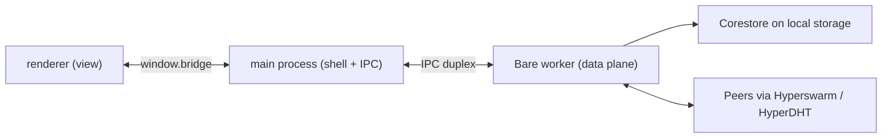

# lightchain-p2p

Peer-to-peer infrastructure for Lightchain AI, built on the Pear/Holepunch stack.

This repository holds the applications and libraries that let models, artifacts
and worker software move between machines **without a hosting account, a CDN or a
foundation-operated server in the path**. It is the implementation of the
peer-to-peer advancements described in the DAO proposal, not a rewrite of the
chain.

---

## Contents

- [What we are building](#what-we-are-building)
- [Status today](#status-today)
- [Architecture](#architecture)
- [Repository layout](#repository-layout)
- [Getting started](#getting-started)
- [How the build works](#how-the-build-works)
- [CI and release](#ci-and-release)
- [Platform support](#platform-support)
- [Testing](#testing)
- [The rules that matter](#the-rules-that-matter)
- [Decisions](#decisions)
- [Reference material](#reference-material)
- [What is next](#what-is-next)

---

## What we are building

The proposal defines five advancements. Three of them are built here, one is
partly here, and one is a design exercise.

| #   | Advancement                     | Lives here | What it means                                                                                                                                                                                                                                                                                                                                      |
| --- | ------------------------------- | ---------- | -------------------------------------------------------------------------------------------------------------------------------------------------------------------------------------------------------------------------------------------------------------------------------------------------------------------------------------------------- |
| 1   | Open model delivery             | Partly     | Every model becomes a Hyperdrive seeded by every worker holding it, removing the approved-model list. Note the proposal says a 32-byte key is self-certifying; in practice a reference is a key **and** a version, because a key alone names a mutable history — see [packages/drive](packages/drive). The on-chain half is in the contracts repo. |
| 2   | Worker distribution and updates | Yes        | One guided installer per OS that installs, registers, supervises and updates a worker. Collapses a nine-phase manual onboarding.                                                                                                                                                                                                                   |
| 3   | Artifact availability           | Yes        | Model archives, adapter manifests, validation reports and benchmarks on Hypercore with blind-peer replication, retrievable after the publisher goes offline.                                                                                                                                                                                       |
| 4   | The universal peer-to-peer hub  | Yes        | One chat application across desktop and terminal, sharing a single Bare core. The user's identity, history, model access, rooms and payments in one place.                                                                                                                                                                                         |
| 5   | Direct peer routing             | No         | Clients reaching workers directly over HyperDHT. Economically sensitive because worker selection determines who earns, so it needs verifiable randomness. Prototype only.                                                                                                                                                                          |

Two things are explicitly **out of scope**, and it saves time to know why.

EIP-4844 blob data availability stays exactly as it is. Blob retention is
enforced on chain by `blobRetentionPeriod >= disputeWindow + resolutionTimeout`,
it is consensus-adjacent, and nothing here touches it.

Pear does not replace the worker. The worker is Go and ships as a container
image; Bare runs JavaScript and can neither execute Go nor replace a container
runtime. Docker, Ollama, a GPU and the LCAI stake all remain requirements. This
repository removes the install-and-update problem, not the inference dependency.

---

## Status today

Be skeptical of anything not listed as verified. The foundation is real and
proven in CI; the applications are scaffolds.

| Component                       | State           | Notes                                                                                                                        |
| ------------------------------- | --------------- | ---------------------------------------------------------------------------------------------------------------------------- |
| Workspace, CI, build matrix     | **Verified**    | Green on Linux; six-target matrix builds and runs its own binaries                                                           |
| `packages/safety`               | **Real**        | Refusal-list decision logic, 10 tests                                                                                        |
| `packages/testkit`              | **Real**        | Two-machine harness, 6 tests including a negative control                                                                    |
| `packages/protocol`             | **Real**        | Model reference and manifest schema, 17 tests                                                                                |
| `packages/drive`                | **Real**        | Publish, resolve and range-read a model drive, 9 tests including publisher-offline                                           |
| `apps/supervisor`               | **Scaffold**    | Builds and runs on all six targets, but is still the upstream template — it prints a version and starts a placeholder worker |
| `packages/da`, `blind`, `chain` | **Not started** | Referenced in CODEOWNERS so ownership is settled before the code exists                                                      |
| `apps/chat`, `apps/seeder`      | **Not started** |                                                                                                                              |
| Code signing                    | **Not started** | Longest external lead time; blocks release on four platforms                                                                 |
| iOS, Android                    | **Deferred**    | By decision — see [ADR 0001](docs/decisions/0001-defer-mobile.md)                                                            |

Two placeholders in `apps/supervisor` will bite you if you assume otherwise: it
still depends on `hello-pear-worker`, and its `upgrade` link in `package.json` is
the template's, not ours. A real link comes from `pear touch`. An app will not
boot without a valid one.

---

## Architecture

Three processes, one rule of thumb: **main is a shell, the worker is the data
plane, the renderer is a view.**



Deciding which side code belongs on is usually easy: anything touching peers,
storage or cryptography is worker code, and anything touching a screen, keyboard
or window is UI code. If it could run unchanged behind a terminal UI, it is
worker code.

This is also why one team can credibly target five platforms. Nearly nothing is
platform-specific — the peer-to-peer logic, protocol logic and cryptography all
live in a Bare worker that embeds identically everywhere. Only the shell differs.

### Two engineering tracks

Track A owns the data plane (`packages/drive`, `da`, `blind`, `apps/seeder`,
`ops`). Track B owns the applications (`apps/supervisor`, `apps/chat`). Shared
packages require a reviewer from both, because a schema mistake in an append-only
log is permanent. See [CODEOWNERS](.github/CODEOWNERS).

---

## Repository layout

```
apps/
  supervisor/        Bare terminal app: installs, supervises, updates a worker
packages/
  safety/            Refusal-list decision logic
  testkit/           Two-machine test harness
  typescript-config/ Shared tsconfig bases (base, node, bare)
  eslint-config/     Shared flat config, including the Pear import boundary
  vitest-config/     Shared test preset
scripts/
  make.mjs           Builds a standalone binary. Must run from the repo root.
  setup-hooks.mjs    Points core.hooksPath at .githooks on install
docs/decisions/      Architecture decision records
.githooks/           Version-controlled git hooks
```

---

## Getting started

You need Node 20 or newer and pnpm 10.33.0 (declared in `packageManager`, so
Corepack will select it).

```bash
pnpm install
pnpm typecheck && pnpm lint && pnpm test && pnpm build
```

That should be green from a clean clone. `pnpm install` also repairs
`core.hooksPath`, which matters — see [commit authorship](#commit-authorship).

To run the supervisor from source, or build a native binary for your machine:

```bash
cd apps/supervisor && pnpm start          # runs under the Bare runtime
node scripts/make.mjs supervisor          # from the repo root
```

The binary lands in `apps/supervisor/out/<host>/`. It is self-contained: whoever
runs it installs no Node, no Bare and no Pear CLI.

---

## How the build works

pnpm workspaces with [Turborepo](https://turbo.build) for task orchestration and
caching. Nothing exotic — but two things about the Bare toolchain will cost you
an afternoon if you meet them cold.

**`bare-build` must run from the repository root.** It resolves modules against
its base directory, and in a monorepo the dependencies are in the root
`node_modules`. Building from inside `apps/supervisor` produces a binary that
compiles cleanly and then dies at startup with `MODULE_NOT_FOUND` for a path like
`file:///C:/node_modules/…`. `scripts/make.mjs` exists to enforce the correct
working directory, and the app's `make` script delegates to it.

**`.npmrc` sets `node-linker=hoisted`.** The Bare toolchain cannot follow pnpm's
symlinked layout when resolving transitive dependencies, so the workspace uses a
flattened `node_modules`. This is a deliberate trade of pnpm's strictness for a
toolchain that works; do not remove it without checking that a built binary still
starts.

`--standalone` embeds the JavaScript bundle into a prebuilt portable runtime,
giving a PE executable on Windows, Mach-O on macOS and ELF on Linux.

---

## CI and release

Two workflows.

[`ci.yml`](.github/workflows/ci.yml) runs on every push and pull request to
`main`: install, format check, lint, typecheck, test, build. Single Ubuntu
runner, about a minute.

[`build-matrix.yml`](.github/workflows/build-matrix.yml) runs on
`workflow_dispatch` or a `v*` tag. Six native runners, each building **and
executing** the binary it produces, then one assembly job collecting the
artifacts into the layout `pear stage` expects.

Cross-compilation is not viable for a signed release, which is why there are six
runners rather than one: signing invokes platform tooling — `codesign` on Apple,
MSIX packaging on Windows. Every runner is native to its target, so every runner
can smoke test what it builds. An artifact that compiles but has never been run
is not evidence of anything.

Staging and seeding are deliberately manual until the release multisig policy is
agreed. Note that applications are client-only by default: something must hold
and announce the upgrade drive, or nobody can install or update. A release nobody
seeds is a release nobody can install.

---

## Platform support

| Target                       | Builds   | Smoke tested |
| ---------------------------- | -------- | ------------ |
| `linux-x64`, `linux-arm64`   | Yes      | Yes          |
| `darwin-x64`, `darwin-arm64` | Yes      | Yes          |
| `win32-x64`, `win32-arm64`   | Yes      | Yes          |
| iOS, Android                 | Deferred | —            |

Mobile is deferred by decision rather than omission. The short version: mobile
cannot receive peer-to-peer updates because the store owns the binary, there is
no working reference implementation, and an open model catalogue is a plausible
App Store rejection that no amount of engineering solves. The reasoning and the
conditions for revisiting are in [ADR 0001](docs/decisions/0001-defer-mobile.md).

Also worth knowing for Linux: Snap and Flatpak cannot receive peer-to-peer
updates either, because their read-only mounts defeat the file swap. AppImage is
the primary Linux artifact for that reason.

---

## Testing

**A unit test is not sufficient for anything that replicates.** Availability bugs
only appear when the publisher goes offline, and code that reads its own
Corestore will pass every assertion you write while being completely unable to
serve a peer.

So the bar for `packages/drive`, `packages/da` and `packages/blind` is a
two-machine test using [`packages/testkit`](packages/testkit), with the publisher
offline for part of the run:

```ts
const net = await createTestNetwork()
const publisher = await net.createPeer('publisher')
const holder = await net.createPeer('holder')
// ... publish, replicate to holder ...
await publisher.goOffline()
// ... assert a third peer can still fetch it ...
await net.destroy()
```

Each peer gets its own Corestore in its own temporary directory, and peers join a
local DHT rather than the public one. The harness carries a negative control
asserting that genuinely unavailable content _fails_ to arrive — keep it, because
a harness that passes regardless of whether replication works is worse than none.

---

## The rules that matter

Three conventions are not style preferences. [CONTRIBUTING.md](CONTRIBUTING.md)
has the detail; this is why they exist.

**Apps never import Pear modules directly.** Anything touching Hypercore,
Hyperdrive, Autobase, blind peering or `sodium-native` lives in `packages/`, and
applications compose packages. This keeps native addons out of the Electron
renderer, where they cannot load under sandboxing. Enforced by lint, not
convention. The exception is `apps/*/workers/**`, which is Bare worker code.

**Schemas are additive-only, forever.** Hypercore and Autobase blocks are signed
and replicated permanently and cannot be migrated. Add optional fields; never
remove, renumber or retype one. A schema mistake is not a bug you fix next
release — it is in the log forever.

**Classify every constant you touch.** Anything denominated in blocks, slots or
epochs changes meaning when block time changes; anything in seconds does not. The
PR template asks you to say which, because getting it wrong is silent.

### Commit authorship

`pnpm install` points `core.hooksPath` at `.githooks`, whose `commit-msg` hook
strips the `Co-authored-by: Cursor` trailer some editors inject. Attribution is by
**email**, so a mismatch is invisible locally and only shows on GitHub. Check
before your first commit:

```bash
git config user.email                  # must be verified on your GitHub account
git log -1 --format='%an <%ae>'
```

---

## Decisions

Architecture decision records live in [`docs/decisions/`](docs/decisions). Record
anything that would otherwise be re-litigated, especially where the reasoning is
non-obvious or the alternative was reasonable.

- [0001 — Defer iOS and Android to a later release](docs/decisions/0001-defer-mobile.md)

---

## Reference material

The Pear/Holepunch stack changed substantially in version 3 and much of what is
on the open internet is stale. Prefer these, which are checked in so the repo is
self-contained:

- [The DAO proposal](docs/proposals/lightchain-on-pear.md) — defines the five advancements
- [Cross-platform delivery plan](docs/proposals/cross-platform-delivery-plan.md) — build, sign, distribute and update, per platform
- [Safety framework proposal](docs/proposals/safety-framework-proposal.md) — the refusal list `packages/safety` implements
- [Audit](docs/proposals/AUDIT.md) — what the current Lightchain stack actually does, verified against source

Two corrections that catch people out: **`pear run` does not exist**, it was
removed in Pear 3 and apps start via their own `npm start`; and **the IPC stream
carries bytes, not objects**, with no built-in JSON or length framing, so pick a
framing format and use it on both sides.

---

## What is next

In rough order of leverage:

1. **Start certificate and account procurement.** The only item with external
   lead time. Windows EV certificates ship on hardware tokens and can take weeks;
   the Apple Developer account gates macOS notarization. It blocks release, not
   development, so it should be running in the background from day one.
2. **Full publish round trip** on a throwaway link: `pear touch`, stage, seed,
   install, publish an update, observe it apply. Unsigned-to-signed is where most
   surprises live, and the supervisor still carries the template's `upgrade` link.
3. **`packages/blind`** — blind-peer registration, so a model stays available
   when neither the publisher nor any worker holding it is online.
4. **Replace the supervisor scaffold** with real install-and-supervise logic,
   composing `packages/drive` to fetch what it installs.

Two decisions from the delivery plan are still open: whether to ship a
conventional Windows `.exe` installer alongside MSIX, and who holds the signing
certificates and how that relates to the release multisig. Those are different
key sets protecting different things and both need custody rules.
