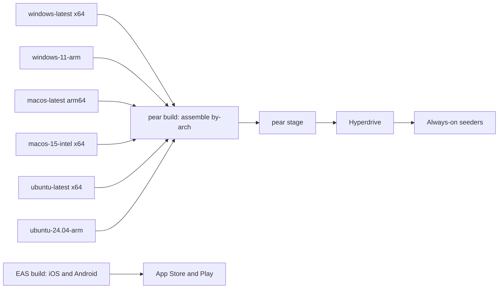

<!-- cover
eyebrow: Lightchain AI · Engineering Plan
title: Shipping the P2P Apps to <grad>Every Platform</grad>
lede: Build, sign, distribute and update the worker supervisor and the chat client across Windows, macOS, Linux, iOS and Android — what the tooling gives us, what it does not, and what has procurement lead time.
runner: Plan · Cross-Platform Delivery
note: Section 1 is the headline constraint. Sections 2 to 4 are the two build pipelines and the CI matrix. Section 5 covers signing, which has the longest lead time. Sections 6 and 7 are distribution and update mechanics per platform. Section 8 is the unsolved mobile problem. Sections 9 onward cover seeding, sequencing and open decisions.
-->

# Shipping the P2P Apps to Every Platform

**Status:** Engineering plan for review
**Applies to:** Advancement 2 (worker supervisor) and Advancement 4 (chat client)
**Targets:** Windows, macOS, Linux on x64 and arm64; iOS and Android

---

## 1. The headline constraint

We are shipping **two applications with two entirely different build pipelines** that share only
the second half of publishing.

The supervisor is a Bare terminal application. It compiles to a single self-extracting binary
per platform with no runtime prerequisite on the operator's machine. The chat client is a Pear
Electron application on desktop, and on mobile it is an Expo app embedding a Bare worklet.

Three facts shape everything below:

**Cross-compilation is not practical for a signed release.** Signing invokes platform tools —
`codesign` and `security` on Apple, MSIX packaging on Windows — so each artifact must be built
on its own operating system. The upstream template's own workflow uses six native runners.

**Mobile does not get peer-to-peer updates.** The desktop updater swaps a file on disk. On iOS
and Android the shell is a store binary and the store owns the update channel. PearPass, the
reference implementation, ships this way and does not use Pear OTA on mobile at all.

**Snap and Flatpak break peer-to-peer updates too.** Their read-only mounts defeat the file
swap. Those channels update through their stores.

---

## 2. Pipeline A: the worker supervisor

A Bare terminal application, from `templates/terminal`.

```
bin.mjs  ──bare-build --standalone──►  native binary per host
                                             │
                                       pear build  ──►  by-arch/<platform-arch>/app/
                                             │
                                       pear stage ──► Hyperdrive ──► pear seed
```

The build command is one line per target, already present in the template:

```bash
bare-build --name lcai-supervisor --standalone \
  --host win32-x64 --out ./out/win32-x64 bin.mjs
```

`--standalone` embeds the JavaScript bundle into a prebuilt portable runtime, producing a PE
executable on Windows, Mach-O on macOS, and ELF on Linux. **The operator installs nothing
else** — no Node, no Bare, no Pear CLI. That is the property that makes the supervisor worth
building.

Docker, Ollama and a GPU remain prerequisites of the *worker*, not of the supervisor.

### Supported host triples

`darwin-arm64`, `darwin-x64`, `linux-arm64`, `linux-x64`, `win32-arm64`, `win32-x64`, plus iOS
and Android targets we do not use for this app. Note that `bare-subprocess` and `bare-daemon`
are desktop-only in the module matrix, which is precisely why the supervisor is a desktop
application.

---

## 3. Pipeline B: the chat client

### Desktop

Electron Forge, from `templates/desktop`. `npm run make` produces:

| Platform | Maker | Artifact |
| --- | --- | --- |
| macOS | `maker-dmg` | `.app` and `.dmg` |
| Windows | `maker-msix` | `.msix` |
| Linux | `pear-electron-forge-maker-appimage` | `.AppImage` |
| Linux | snap and flatpak makers | `.snap`, Flatpak tarball |

**Windows is MSIX only.** The template configures no NSIS or Squirrel maker, so there is no
conventional `.exe` installer. `maker-deb` and `maker-rpm` are installed but unconfigured. If
we want a `.deb` or a classic Windows installer, that is our work to add.

### Mobile

Expo plus `react-native-bare-kit`, with the peer-to-peer logic packed as a worklet bundle:

```bash
bare-pack -p android --linked --out bundles/app-android.bundle.js src/worklet/app.js
bare-pack -p ios     --linked --out bundles/app-ios.bundle.js     src/worklet/app.js
```

`--linked` is required: mobile cannot load native addons from disk, so `sodium-native` and
`rocksdb-native` must be linked ahead of time. The bundle is then embedded and started by the
React Native host.

---

## 4. CI: six native runners

Both pipelines need the same matrix, and it cannot be collapsed onto one machine.

<!-- caption: Six native runners feed one assembly job that produces the deployment drive -->



Mobile builds run separately through EAS and land in stores, not in the drive.

Assembly is one command that gathers every platform's artifact into the deployment layout:

```bash
pear build --package=./package.json \
  --darwin-arm64-app ./out/darwin-arm64/LightchainChat.app \
  --win32-x64-app    ./out/win32-x64/LightchainChat.msix \
  --linux-x64-app    ./out/linux-x64/LightchainChat.AppImage \
  --target lcai-chat-1.0.0
```

Run it outside the app tree, or the staged drive balloons.

---

## 5. Signing: start this first

This has the longest lead time of anything in the plan and blocks release rather than
development. Begin procurement in week one.

| Platform | Requirement | Lead time risk |
| --- | --- | --- |
| macOS | Apple Developer Program, Developer ID certificate, notarization via notarytool | Account approval, then per-build notarization latency |
| Windows | Code signing certificate. **The MSIX Publisher CN must match the certificate permanently** | EV certificates ship on hardware tokens and can take weeks |
| iOS | Apple Developer Program, distribution certificate, provisioning profiles | Same account as macOS |
| Android | Play Console account, upload key, app signing key | Account verification |
| Linux | AppImage is typically unsigned; Snap and Flatpak sign at the store | Low |

Two things worth deciding early because they are effectively permanent.

**The Windows Publisher CN is forever.** MSIX identity binds to the certificate subject. Change
the certificate later and existing installs will not upgrade — they become a separate app.

**macOS entitlements.** The template ships `cs.allow-jit` and
`cs.allow-unsigned-executable-memory`, which the JavaScript runtime needs. Notarization with
those entitlements is routine but must be tested early, not discovered at release.

The upstream `holepunchto/actions/make-pear-app` action already wires macOS p12 plus
notarization and Windows certificate handling into CI, so we are not writing this from scratch.
`bare-build` has its own `--sign` family of flags for the supervisor binary.

---

## 6. Distribution

| Platform | Primary channel | Also possible |
| --- | --- | --- |
| Windows | Download `.msix` from the site | `pear install pear://…` for Pear-native users |
| macOS | Download `.dmg` | `pear install`, Homebrew cask |
| Linux | Download `.AppImage` | Flathub, Snap Store, `pear install` |
| Supervisor, all desktop | Download a single binary | `pear install` |
| iOS | App Store, TestFlight for beta | — |
| Android | Play Store | F-Droid, direct APK |

`pear install` is a real path but it is a power-user one: it requires the Pear CLI. Ordinary
users download a normal installer. Both routes end at the same binary and both receive updates
the same way on desktop.

---

## 7. Update mechanics, and where they stop working

The desktop updater watches the `upgrade` Hyperdrive, mirrors a newer version, and swaps it in.
The per-platform apply path differs and two combinations simply do not work.

| Platform and format | Apply mechanism | Works |
| --- | --- | --- |
| macOS `.app` | File swap | Yes |
| Linux `.AppImage` | File swap | Yes |
| Windows `.msix` | MSIX package manager add | Yes |
| Windows `.exe` supervisor | Rename current, promote new | Yes |
| **Linux Snap** | Read-only mount defeats the swap | **No — store updates** |
| **Linux Flatpak** | Same | **No — store updates** |
| **iOS and Android** | Store owns the binary | **No — store updates** |

The practical consequence: if we publish to Snap or Flathub, those users are on a different
update cadence from everyone else, and we maintain two release processes for one platform.
**Recommendation: ship AppImage as the primary Linux artifact and treat store channels as
optional later.**

---

## 8. The unsolved problem: mobile

The proposal says the chat client gives us "one codebase across desktop, terminal, iOS and
Android." That is true of the *code* — the Bare worker is shared — but it is **not true of
delivery**, and the plan should say so.

On mobile:

- The app shell updates through the App Store and Play Store, with review latency measured in
  days and no ability to push a fix immediately.
- Pear's own documentation references a `pear-mobile` counterpart, but it is not present in the
  mirror and PearPass does not use it. There is no working reference for mobile peer-to-peer
  updates.
- **No guidance exists anywhere in the Pear documentation on App Store or Play policy for a
  peer-to-peer application that updates itself.** That absence is the finding. We must form our
  own view.

There is a second, sharper policy question. Advancement 1 makes the model catalogue open —
anyone can publish and any user can call any model. An App Store reviewer looking at an
application that fetches arbitrary third-party AI models over a peer-to-peer network, with no
curation, is a plausible rejection. This is not a technical problem and no amount of
engineering solves it.

Three options, and we should pick one deliberately:

1. **Ship mobile through stores with a curated model list**, accepting that mobile is a more
   constrained product than desktop.
2. **Ship mobile as desktop-parity via sideload and F-Droid on Android**, and accept no iOS.
3. **Defer mobile entirely** until desktop is proven, and revisit with real usage data.

My recommendation is option 3 for the first release. Mobile roughly doubles the delivery
surface, contributes the store-review dependency, and is the least proven part of the stack.

---

## 9. Seeding

Applications are client-only by default: they download updates but do not re-serve them.
Something must hold and announce the upgrade drive or **nobody can install or update**.

This is the same always-on infrastructure the parent plan calls for. Concretely, the release
drive needs seeding by at least two independently hosted machines, and it should be registered
with the blind peers so it survives them.

A release that nobody seeds is a release nobody can install.

---

## 10. Build order

1. **Week 1: start certificate and account procurement.** Everything else can proceed in
   parallel, and this is the only item with external lead time.
2. Get `templates/terminal` building on all six desktop targets in CI, unsigned. Proves the
   matrix before any application code exists.
3. Add signing to the CI matrix and verify a signed artifact installs cleanly on a machine that
   has never seen it. Unsigned-to-signed is where most surprises live.
4. Full publish round trip on a throwaway link: `pear touch`, stage, seed, install, publish an
   update, observe it apply. This is Spike 4 in the parent plan.
5. Only then start supervisor application code.
6. Chat desktop follows the same path with the Electron pipeline.
7. Mobile last, and only if Section 8 is resolved.

---

## 11. Open decisions

1. Do we ship a conventional Windows `.exe` installer alongside MSIX, given the template only
   configures MSIX and MSIX sideloading has its own user friction?
2. AppImage only for Linux, or do we take on Snap and Flatpak knowing they cannot receive
   peer-to-peer updates?
3. Which mobile option from Section 8, and who owns the store relationship?
4. Do we support arm64 Windows at first release, or defer it? It doubles the Windows matrix for
   a small user base.
5. Who holds the signing certificates, and how do they relate to the release multisig? These are
   different key sets protecting different things and both need custody rules.
6. Do we publish the supervisor through `pear install` as well as direct download, or keep one
   channel to reduce support surface?
