<!-- cover
eyebrow: Lightchain AI DAO · Governance Proposal
title: A <grad>Peer-to-Peer</grad> Infrastructure Layer for Lightchain AI
lede: Open model delivery, faster responses, and one universal peer-to-peer hub across Windows, macOS, Linux, iOS and Android — with the chain as the settlement layer beneath it all.
runner: Proposal · Peer-to-Peer Infrastructure Layer
note: Sections 1 to 4 set out what is proposed and the architecture it produces. Sections 5 to 9 are the five advancements, each with its own pros, cons, risks, and acceptance criteria. Sections 10 and 11 go into depth on LCAI settlement and on response latency. Sections 12 onward cover the timeline, risk, and the votes.
glance: proposal
-->

# Lightchain AI: A Peer-to-Peer Infrastructure Layer

**Status:** Design paper for community discussion and DAO vote
**Scope:** Open model delivery, worker distribution, artifact availability, clients, payments, latency
**Explicitly out of scope:** Consensus rules, EVM execution, tokenomics, contract logic

---

## 1. Executive summary

This paper proposes a set of advancements to Lightchain AI's infrastructure built on the
Holepunch peer-to-peer stack: Hypercore, Hyperdrive, Hyperswarm, Autobase, and blind
peering. It is the technology behind Keet and PearPass, and it is production-proven.

Five advancements, each independently valuable:

1. **Open model delivery.** Any model, published by anyone, addressed by a cryptographic
   key and streamed peer-to-peer to whichever worker needs it. No approved list.
2. **Worker distribution and updates.** One guided installer per platform that registers,
   supervises, and updates itself over the air.
3. **Artifact availability.** Model archives, validation reports, and benchmarks stored on
   verifiable, self-replicating logs.
4. **The universal peer-to-peer hub.** One application on Windows, macOS, Linux, iOS, and
   Android that becomes the front door to the entire Lightchain network, with conversation
   history held by participants rather than by a hosted database.
5. **Direct peer routing.** Users connecting straight to workers over HyperDHT.

The fourth is the one users will actually see, and it is worth stating plainly what it is.
It is not a second chat app. It is the **universal hub for Lightchain AI decentralized
chat**: a single application, shipping to all five platforms from one codebase, through
which a user holds their identity, reaches any model, talks to the worker network, keeps
their history, and pays for what they use. Everything else in this paper exists to make
that hub possible, and the blockchain is what holds the whole peer-to-peer ecosystem
together underneath it.

Two further sections address the questions that matter most to the product. **Section 10**
sets out in detail how LCAI settlement works across the new network, including how open
model pricing works when anyone can publish a model. **Section 11** analyses where response
time is actually spent and identifies the changes that would take time-to-first-token from
tens of seconds to under a second, along with what a faster block time would and would not
achieve.

None of this changes consensus, the EVM, or the economics of the token. Every advancement
is additive: the current path keeps working while the new one proves itself.

---

## 2. Primer: what Pear and Holepunch provide

- **Hypercore** is an append-only log signed by its author. Any reader can verify any block
  against a merkle root without trusting the source it came from.
- **Hyperdrive** is a filesystem on Hypercore, with streaming and range reads. A drive is
  identified by a 32-byte public key.
- **Hyperswarm and HyperDHT** provide peer discovery and direct connection including NAT
  traversal, addressed by public key rather than by IP.
- **Autobase** lets multiple writers contribute to one causally ordered view.
- **Blind peering** provides always-on replication. A blind peer, in Holepunch's words,
  "stores and serves Hypercores without decrypting or interpreting their contents."
- **Pear** is the runtime and distribution system. Applications are addressed by a
  `pear://` link and update peer-to-peer with no download servers.

The property that carries this whole design: content is addressed and verified by
cryptographic key rather than by location.

One detail turns out to matter enormously. A Hyperdrive key is **32 bytes**. So is a
`bytes32` model identifier in `AIConfig`. The two are the same shape, which means a model
can be identified on-chain by the exact key that also retrieves it.

---

## 3. Design principles

- **Additive, never disruptive.** Every advancement runs alongside the existing path until
  it is measurably better.
- **Verifiable by construction.** Anything fetched over the network verifies against a
  signed root before use.
- **Permissionless by default.** Where a gate exists for operational convenience rather
  than for security, remove it.
- **Keep consensus untouched.** Staking, slashing, finality, and the EVM are out of scope.
- **Latency is a feature.** Design choices are judged partly on what they do to
  time-to-first-token.

---

## 4. Target architecture

<!-- caption: Target architecture with the peer-to-peer layer added beneath the chain -->
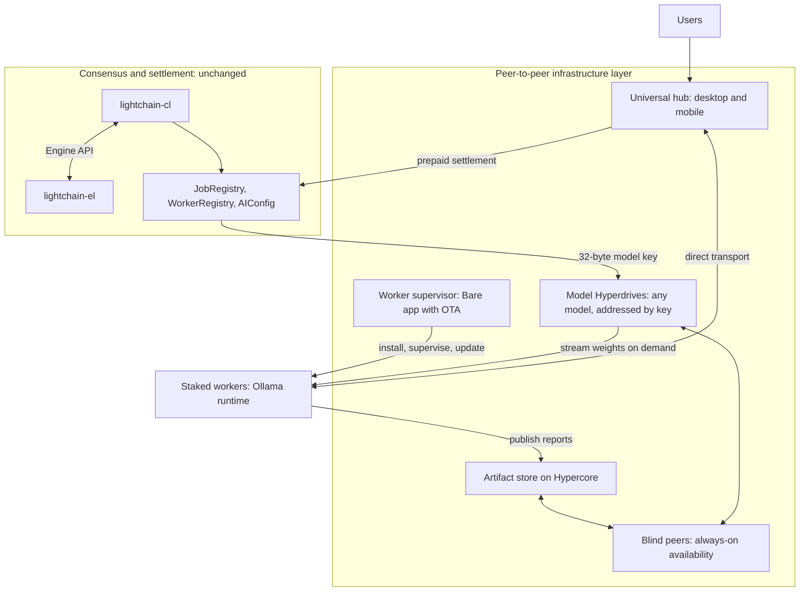

---

## 5. Advancement 1 — Open model delivery

### What it does

Make every model addressable, verifiable, and self-distributing, and let users call any of
them. A model becomes a Hyperdrive: weights, tokenizer, template, and a manifest, published
once and seeded thereafter by every worker that holds it.

### Removing the approved-model list

Today a model must be registered before it can be priced. `AIConfig.calculateJobFee` looks
up `modelFee[modelId]` and reverts `ModelNotConfigured` when the entry is zero, which means
the set of callable models is exactly the set an administrator has configured.

This proposal replaces that with **permissionless model publication**:

- **Identity.** `modelId` becomes the 32-byte Hyperdrive key. It is self-certifying: the
  identifier is the retrieval address and the verification root simultaneously. No registry
  entry is needed to name a model.
- **Publication.** Anyone publishes a model by creating a drive containing the weights and
  a signed manifest declaring architecture, parameter count, quantisation, context length,
  and licence.
- **Pricing.** Instead of a per-model fee that an administrator sets, fees resolve through
  a **class-based default curve** keyed on the declared parameter count and context length
  in the manifest. A registered fee, if one exists, still takes precedence, so existing
  models keep their current prices. Unregistered models price automatically from their
  class rather than reverting.
- **Worker opt-in.** Workers advertise the classes they will serve and may set a multiplier
  on the default. A worker unwilling to serve a 70B model simply does not advertise that
  class.
- **On-demand acquisition.** A worker asked for a model it does not hold fetches the drive,
  verifies it against the key, and serves the job. Cold start is a download, not a refusal.

The result: a user can call any model that at least one worker is willing to run, and new
models reach the network without anyone's approval.

<!-- caption: Open model publication, pricing by manifest class, and on-demand acquisition -->
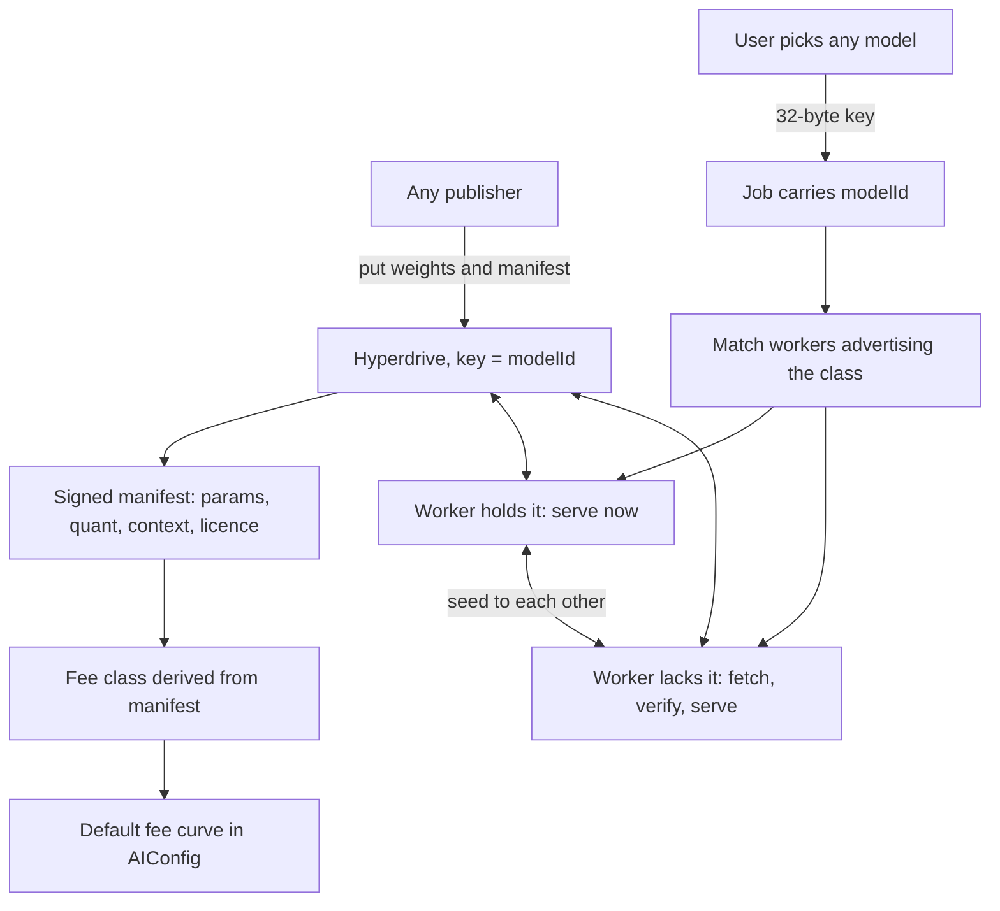

### Pros

- **Any model, immediately.** The catalogue stops being a governance bottleneck and becomes
  a market. Users call what they want; workers serve what they choose to.
- **Distribution cost falls as the network grows**, inverting the usual egress
  relationship. Every worker that pulls a model becomes a source for it.
- **Integrity is structural.** Weights verify against a signed root, so a worker cannot be
  served tampered weights and a user can confirm which weights answered them.
- **Incremental updates transfer only changed content.** Publishing version N+1 does not
  re-transfer unchanged files.
- **LoRA adapters are cheap to distribute** once the base model is widely seeded, because
  only the adapter moves.
- **Range-request streaming** lets a runtime begin loading before a download completes,
  which is what makes on-demand acquisition tolerable.
- **Pre-warming becomes possible.** Workers can hold popular drives resident, which
  directly reduces time-to-first-token.

### Cons

- **Cold start on an unseeded model** is slower than a model already resident. Popular
  models will be fast; a freshly published one will not be until it spreads.
- **Disk and upload bandwidth move onto operators**, which must be configurable and clearly
  disclosed.
- **Open publication invites low-quality and duplicate models.** Discovery and reputation
  become product problems that the registry previously solved by exclusion.
- **Licence responsibility shifts to publishers.** Peer redistribution makes each seeding
  worker a redistributor. The manifest must carry a licence declaration and operators must
  be able to filter on it.
- **Fee-class inference can be gamed** by a publisher declaring a smaller class than the
  model really is. The manifest is signed and the drive is content-addressed, so this is
  detectable, but it needs a challenge path.

### Risks and mitigations

- *A publisher misdeclares model class to underprice* → workers verify declared parameter
  count against the actual weight files on first load and refuse mismatches; repeat
  offenders are filtered by key.
- *Cold start on an unseeded model looks like a failure* → surface acquisition progress in
  the client, and let workers decline rather than time out.
- *Abusive or unlicensed models published openly* → operator-side allow and deny lists by
  publisher key and by declared licence, applied locally rather than by protocol.
- *Model sprawl makes discovery hard* → a curated index published as its own drive, which
  is advisory rather than gating.

### Acceptance criteria

A model published by a non-administrator is callable end to end by a user who has never
held it, priced automatically from its manifest class, fetched on demand by a worker that
did not previously hold it, verified against its drive key, and served — with acquisition
and inference timings recorded separately.

---

## 6. Advancement 2 — Worker distribution and updates

### What it does

Collapse a nine-phase onboarding into one guided installer per operating system that
installs, registers, supervises, and updates itself.

### The constraint, stated plainly

The worker is Go and ships as a container image. Pear runs JavaScript on Bare and can
neither execute Go nor replace a container runtime. So Pear becomes the **installer,
supervisor and update channel**, not the worker. Docker, Ollama, a GPU with at least 8 GB
of VRAM, and the 50,000 LCAI stake all remain requirements. This advancement removes the
install-and-update problem, not the inference dependency.

<!-- caption: Operator onboarding today versus the proposed guided installer -->
```mermaid
flowchart TB
  subgraph before [Today]
    B1["Install Docker, Ollama, Foundry cast"]
    B2["Clone the toolkit repository"]
    B3["Run nine phases in order"]
    B4["Generate keys, fund wallet, stake"]
    B5["Pull image and launch container"]
    B6["Compare digests by hand to update"]
    B1 --> B2 --> B3 --> B4 --> B5 --> B6
  end

  subgraph after [Proposed]
    A1["Download one installer"]
    A2["Guided flow: keys, funding, registration, stake"]
    A3["Supervisor pulls and verifies the worker image"]
    A4["Supervises Docker and Ollama; updates arrive over the air"]
    A1 --> A2 --> A3 --> A4
  end
```

### Pros

- **The largest adoption lever available.** Operator count tracks onboarding friction, and
  this removes most of the removable part.
- **Zero blast radius.** Touches no consensus code, no contracts, no chain state.
- **Over-the-air updates with no download infrastructure**, so the network converges on
  current software instead of drifting.
- **Deletes the Foundry dependency.** `cast` is used only for key generation, address
  resolution, and funding, all of which a supervisor can do natively.
- **Model pre-warming becomes manageable**, because the supervisor can hold and refresh the
  model drives a worker advertises.
- **Cross-platform from one codebase.** Windows operators stop being second-class.
- **Day-two operations become first-class**: status, drain, and deregister as commands.

### Cons

- **A new trusted distribution channel.** Whoever holds the release key controls what
  operators run. This must be multisig-gated with the same seriousness as contract
  upgrades, and it is the most important governance question in this paper.
- **Correlated failure risk.** A supervisor defect could take workers offline
  simultaneously, which a manual process cannot do.
- **Auto-update propagates bad releases as fast as good ones**, so staged rollout and
  rollback are mandatory rather than optional.
- **Duplicate maintenance** while both the toolkit and the supervisor are supported.

### Risks and mitigations

- *Compromised release* → multisig signing, reproducible builds, canary cohort, published
  hashes.
- *A bad update takes down the fleet* → percentage rollout, automatic rollback on
  health-check failure, and an operator-controlled version pin.
- *Operators distrust auto-update* → opt-out with clear disclosure, never silent.

### Acceptance criteria

A clean Windows machine and a clean Ubuntu machine each go from zero to a registered worker
processing a job using one installer, and a subsequently published update lands without
operator action and can be rolled back.

---

## 7. Advancement 3 — Artifact availability

### What it does

Store model archives, adapter manifests, validation reports, and benchmark definitions on
Hypercore with blind-peer replication, so they are verifiable and retrievable without a
hosting account.

EIP-4844 blob data availability is **not** part of this. Blob retention is enforced on
chain by the invariant `blobRetentionPeriod >= disputeWindow + resolutionTimeout`, it is
consensus-adjacent, and it stays exactly as it is.

<!-- caption: Publishing and verifying an artifact after the publisher goes offline -->
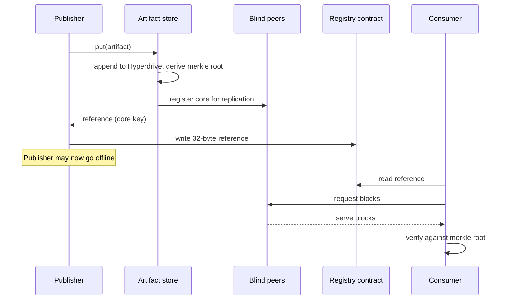

### The reference-encoding constraint

References must be designed to fit existing on-chain fields. Two apply:

- The registry contracts store references as `string` with only a non-empty check, so a
  Hypercore key is accepted without a type change.
- The deployed chat utility contract enforces a 64-byte maximum on stored references. A
  64-character hex encoding of a 32-byte key fits exactly; a prefixed `pear://` form does
  not. The encoding is therefore fixed as bare hex, decided up front rather than
  discovered later.

### Pros

- **Verifiability by default.** Every block verifies against a signed merkle root, so a
  validator can prove an artifact is exactly what was published.
- **Sparse, range-based retrieval** for a validator spot-checking part of a large artifact.
- **Blind peers cannot read the data.** They replicate ciphertext without decryption keys.
- **Retrieval does not depend on an account** remaining in good standing anywhere.
- **Reversible.** A fallback rule keyed on reference format means the previous path can be
  restored at any point.

### Cons

- **Availability requires a live source.** Holepunch is explicit: "A new user can only
  download data that at least one online peer already holds." Blind peers must be operated;
  this changes who runs infrastructure rather than removing infrastructure.
- **Retention becomes our responsibility** rather than a vendor's.
- **Hypercore keys are less familiar than CIDs** to auditors and integrators, and will need
  documentation.
- **A dual-run period** with two storage paths live.

### Risks and mitigations

- *An artifact is unretrievable during a challenge* → set blind-peer retention beyond the
  48-hour model-variant challenge window with a defined margin, and gate cutover on
  automated retrievability probes rather than on a date.
- *The blind peer set is too small or correlated* → place replicas on independently hosted
  peers using the client's `group` option, defaulting to at least two.
- *Encoding is settled too late* → fix the 64-byte hex encoding during design and test it
  against the deployed contract before anything depends on it.

### Acceptance criteria

A validation report publishes through Hypercore, is retrieved and merkle-verified from a
second machine with the publisher offline, survives longer than the 48-hour challenge
window, and is benchmarked for publish and cold-fetch latency.

---

## 8. Advancement 4 — The universal peer-to-peer hub

### What it does

Ship one application to Windows, macOS, Linux, iOS, and Android that serves as the
universal hub for Lightchain AI decentralized chat. The web app keeps reach and instant
access for anyone with a browser; the hub is the trustless flagship. Both dispatch
inference to the same worker network and settle through the same contracts.

"Hub" is meant literally. This is not a chat window with a wallet bolted on. It is the
single place a user holds their identity, reaches any published model, joins rooms with
other people, keeps their own history, runs or monitors a worker if they choose to, and
pays for all of it from one balance. Every other advancement in this paper surfaces
through it.

### One core, five platforms

The reason a single team can credibly ship to five platforms is that almost none of the
code is platform-specific. All peer-to-peer logic, all protocol logic, and all cryptography
live in a Bare worker. Bare is a small JavaScript runtime that embeds identically on
desktop and mobile, so the same worker binary logic runs everywhere. Only the presentation
shell differs.

| Platform | Shell | Shared Bare core |
| --- | --- | --- |
| Windows, macOS, Linux | Pear desktop runtime | Identical |
| iOS | Native shell embedding Bare | Identical |
| Android | Native shell embedding Bare | Identical |
| Terminal | Text UI over the same worker | Identical |

This is the same architecture `tetherto/pearpass-*` already ships in production across
desktop, mobile, and a browser extension, so the pattern is proven rather than
speculative.

<!-- caption: One Bare core shared across every platform, with only the shell differing -->
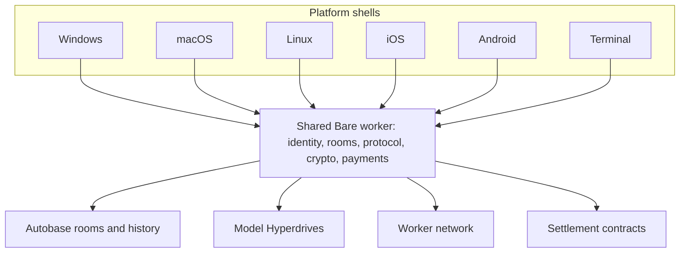

### What the hub does

- **Identity.** The user's wallet is the root identity. The same key that pays is the key
  that signs messages and joins rooms, so there is no separate account system.
- **Any model.** The model picker is an open field over published drives rather than a
  fixed list, which is what Advancement 1 makes possible.
- **Conversation.** One-to-one and group rooms over Autobase, with invites through
  `blind-pairing` that never expose room keys.
- **History.** Held by the participants, replicated between their own devices, and kept
  reachable by blind peers.
- **Payments.** One prepaid balance funds every message, described in Section 10.
- **Worker operation.** For users who also run a worker, the same application can host the
  supervisor from Advancement 2 rather than being a separate tool.

### The blockchain underneath the ecosystem

A peer-to-peer network answers "how does data move." It does not answer "who can I trust"
or "who gets paid." That is what the chain is for, and it is why this design needs both.

The division of responsibility is clean:

| Concern | Handled by | Why there |
| --- | --- | --- |
| Moving bytes | Hyperswarm and HyperDHT | No server should be in the path |
| Storing history and weights | Hypercore and Hyperdrive | Verifiable, self-replicating |
| Who is a real worker | `WorkerRegistry` and stake | Sybil resistance needs cost |
| Which model is which | 32-byte key anchored on chain | One canonical identifier |
| What a job costs | `AIConfig` fee resolution | Prices must be agreed, not asserted |
| Who gets paid | `JobRegistry` escrow and release | Payment needs finality |
| What happens when someone cheats | Disputes, bonds, slashing | Accountability needs enforcement |

Every peer in the network can discover, verify, and transact with every other peer because
the chain provides the shared facts they all agree on: who is staked, what a model is, what
a job costs, and who was paid. Peer-to-peer supplies the bandwidth; the chain supplies the
truth. Neither layer is sufficient alone, and this is the sense in which the blockchain
supports the entire peer-to-peer ecosystem rather than merely coexisting with it.

<!-- caption: The chain as the coordination and settlement substrate beneath the peer-to-peer layer -->
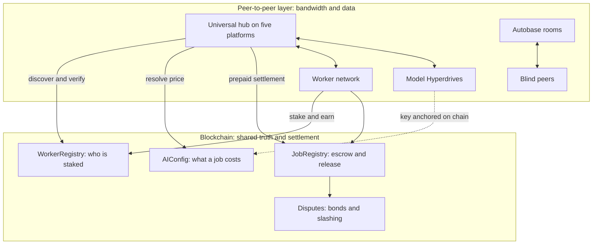

### What it inherits

The web client already runs the full protocol path: it encrypts the prompt, uploads it as a
blob, calls `submitJob` on chain against a prepaid balance, and receives the response over
the relay. The hub does not invent protocol integration — it ports it, and then replaces
the hosted parts: conversation history moves from a database into Autobase rooms, and
transport moves from the relay to a direct connection.

<!-- caption: Process split inside the hub application -->
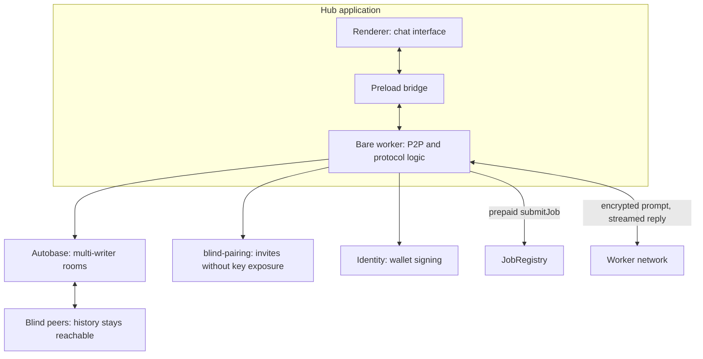

`tetherto/pearpass-*` is a shipped production reference for this exact shape.

### Pros

- **Conversation history belongs to participants.** There is no hosted database in the
  trust path, so no operator can read it.
- **Censorship resistance.** No hosting account to suspend, no domain to seize.
- **Offline-capable.** Local history reads without connectivity and syncs on reconnect.
- **Five platforms from one codebase**, because the protocol logic lives in a Bare worker
  independent of the UI. Shipping to mobile costs a shell, not a rewrite.
- **One front door for the whole network.** Identity, models, rooms, payments, and worker
  operation converge in a single application instead of being spread across a web app, a
  wallet, a block explorer, and a command-line toolkit.
- **Direct transport removes two hops** from the response path, which Section 11 quantifies.
- **Any model, natively.** The hub's model picker becomes an open field over published
  drives rather than a fixed list.
- **Strategic differentiation.** Very few AI chat products can credibly say the operator
  cannot read user conversations.

### Cons

- **The largest workstream here by a wide margin.** The web client is 178 source files and
  105 components; parity is a product effort, not a port.
- **No browser access without a relay**, which is why the web app stays. Expect a permanent
  two-client maintenance burden.
- **Eventual consistency, not transactions.** Autobase gives causal ordering, so concurrent
  edits need explicit conflict rules.
- **New-device history depends on blind peers** being reachable.
- **Server-side conveniences are harder**: global search, analytics, abuse detection, and
  rate limiting all assume a server that can read content.
- **No moderation backstop.** No operator can remove content network-wide. For a public
  product this is a policy question the DAO must answer before launch.
- **Key management is user-facing.** Losing keys can mean losing history unless recovery is
  designed deliberately.

### Risks and mitigations

- *Product regression against a polished web app* → ship as an additional client, never a
  forced migration, and hold to a published parity bar before promoting it.
- *Moderation and abuse* → an explicit DAO policy before public launch; options include
  client-side filtering, reputation, and invite-gated rooms via `blind-pairing`.
- *Schema lock-in* → append-only logs cannot be migrated retroactively, so room and message
  schemas must be additive-only from the first commit, defined with `hyperschema`.
- *Users lose keys and lose history* → treat the existing wallet as the identity root so
  recovery matches what users already do.

### Acceptance criteria

Two users on separate machines hold a conversation with inference served by the live worker
network, jobs settle on chain exactly as the web client settles them, history survives both
users going offline and returning, and invites work without exposing room keys. The same
build runs on desktop and on at least one mobile platform against the same rooms, with
history syncing between a user's own devices.

---

## 9. Advancement 5 — Direct peer routing

### What it does

Let clients discover and connect to workers directly over HyperDHT, addressed by the
worker's registered public key, rather than passing through intermediary services.

### Why it is gated

Worker selection determines who earns, which makes it economically sensitive. Doing it
permissionlessly and fairly depends on verifiable randomness, so this advancement is
proposed as a design and a testnet prototype rather than a migration.

<!-- caption: Routing today versus a direct client-to-worker connection over HyperDHT -->
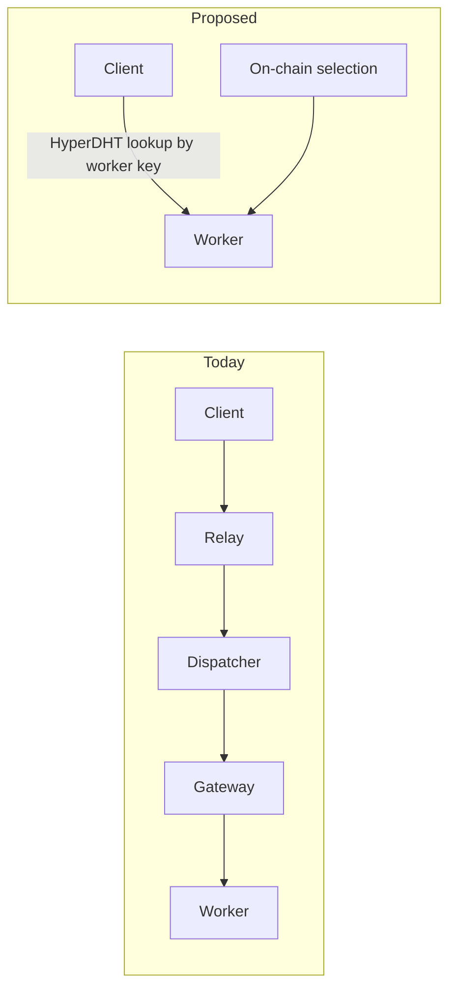

### Pros

- **Removes hops from the critical path**, which is worth hundreds of milliseconds per
  message and more under load.
- **NAT traversal is exactly what HyperDHT is built for**, and it is the hard part of
  direct worker connections.
- **Transport already carries ciphertext**, so removing intermediaries does not change the
  cryptographic model.
- **Streaming becomes natural.** A direct connection carries incremental tokens without an
  intermediary having to relay each frame.

### Cons

- **Depends on verifiable randomness** for fair permissionless selection.
- **Highest consequence of failure**: a routing defect stops inference network-wide.
- **Loss of a central vantage point** for observability, which must be replaced with
  client-reported and worker-reported telemetry.
- **Sybil and fairness questions** that a central selector currently sidesteps.

### Acceptance criteria

Not proposed for adoption in this vote. The requested output is a design document and a
testnet-only prototype, returning to the DAO with measured results.

---

## 10. LCAI payments across the new network

This section is deliberately detailed, because the payment path is what makes the product a
protocol rather than an application, and because open model publication changes how pricing
must work.

### 10.1 How settlement works today

Chat settles in **native LCAI on the Lightchain L1**. The token is the gas currency of the
chain, not an ERC-20, so fees move as `msg.value` rather than as token transfers.

The essential mechanism is **prepaid balance with delegation**, and it is the reason chat
does not feel like a blockchain application:

1. The user deposits native LCAI once, calling `depositAndAuthorize`. This credits
   `prepaidBalances[user]` and simultaneously authorises a delegate and grants it an
   allowance equal to the deposit.
2. The user creates a session once, binding a model and a worker with an encrypted session
   key.
3. For every subsequent message, the delegate calls `submitJobOnBehalf`, which debits both
   the prepaid balance and the delegate allowance by the job fee.

The consequence is that **a user signs zero transactions per message**. Signing happens at
deposit and at session creation, and then not again until the balance runs down.

The safety properties are worth stating precisely, because "a service can spend my money"
deserves scrutiny. A delegate can only ever call one function, only against the user's own
session, only for the exact fee the contract computes, only up to the granted allowance,
and only while the prepaid balance lasts. The user can revoke authorisation or reduce the
allowance to zero at any time, and doing so is a single transaction.

<!-- caption: The LCAI settlement lifecycle for a single chat message -->
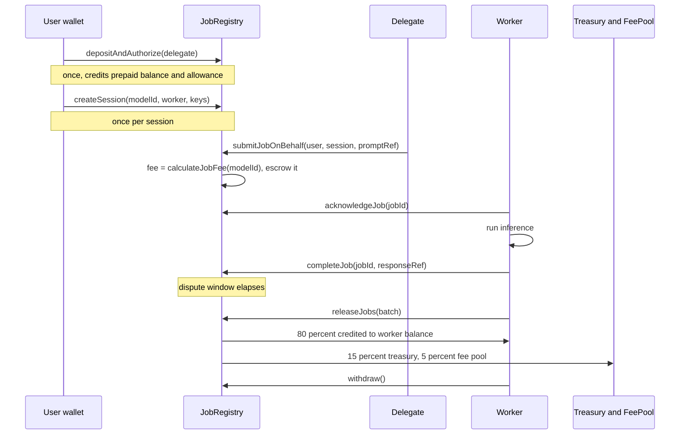

### 10.2 Where the money goes

On release, each job fee splits three ways by basis points that sum to 10,000:

| Recipient | Share | Purpose |
| --- | --- | --- |
| Worker | 80% | Payment for inference performed |
| Protocol treasury | 15% | DAO-controlled, governed by timelock |
| Fee pool | 5% | Distributed to validators alongside the gas-fee share |

Release is not immediate. A completed job becomes releasable once the dispute window has
elapsed, at which point anyone may call `releaseJob`, and in practice workers batch this:
the release scheduler probes periodically and settles in batches rather than paying gas per
job. Worker earnings accumulate in a pull-based balance withdrawn on demand.

### 10.3 What secures the payment

Three mechanisms, all already in place and unchanged by this paper:

- **Stake.** A worker locks 50,000 LCAI to register. Failing to acknowledge, failing to
  complete, or losing a dispute slashes a percentage of the minimum stake, and repeated
  offences suspend the worker.
- **Escrow.** The fee is held by the contract from submission until release, so a worker
  cannot be paid for a job it did not complete and a user cannot retract payment for one it
  did.
- **Bonded disputes.** A challenge requires a bond equal to the job fee. A successful
  challenge refunds the user and slashes the worker; an unsuccessful one forfeits the bond.

### 10.4 Pricing when anyone can publish a model

This is the substantive change. Today a fee is a per-model figure that must be configured
before the model is callable, which is what makes the model list closed.

The proposed mechanism keeps the same settlement path and changes only how the fee is
resolved:

<!-- caption: How a job fee resolves when any model may be published -->
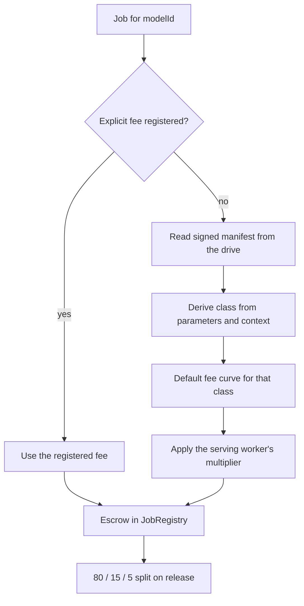

Four properties this preserves:

- **Existing models are unaffected.** A registered fee always wins, so current prices and
  current behaviour continue exactly as they are.
- **The split is unchanged.** Open models settle through the same escrow and the same
  80/15/5 distribution, so protocol revenue scales with usage regardless of who published
  the model.
- **Prepaid delegation still applies.** The delegate spends against an allowance, and the
  allowance check happens against whatever fee resolves, so a user cannot be charged more
  than they authorised.
- **Workers are not forced to serve anything.** A worker advertises the classes it will
  run, and its multiplier expresses what it will run them for.

Two new questions the DAO must settle, both listed in Section 17: who sets the default fee
curve, and whether publishers should receive a share of fees for models they publish. A
publisher share would create a direct incentive to bring good models to the network, but it
also introduces a fourth party to the split and is not proposed here.

### 10.5 What the peer-to-peer layer changes about payments

Deliberately little, and that is the point. Settlement stays on chain in native LCAI with
the same contracts, the same escrow, and the same split. What changes:

- **Model acquisition stops being a payment problem.** A worker that lacks a model fetches
  it peer-to-peer rather than being unable to bid, so a wider set of workers can serve any
  given job and pricing gets more competitive.
- **Delivery costs leave the fee.** Bandwidth for weights is contributed by peers rather
  than billed, so more of the fee is inference and less is logistics.
- **Direct transport reduces the infrastructure the fee has to cover**, since fewer
  intermediary services sit between user and worker.
- **Subscriptions remain separate.** The Ethereum-mainnet subscription product is an ERC-20
  entitlement with no on-chain link to per-job fees. Unifying the two is a worthwhile piece
  of product work and is out of scope here.

---

## 11. Latency: block time and response time

Two different questions get conflated here, so this section separates them: how fast the
chain confirms, and how fast a chat answer appears. They interact, but the second is
dominated by factors other than the first.

### 11.1 Where the time goes

The chain runs **6-second slots with 6 slots per epoch**, giving a 36-second epoch and
finality in roughly one to three epochs. Finality is not in the chat path — the user never
waits for it.

What the user does wait for, in order:

| Stage | Contributor | Order of magnitude |
| --- | --- | --- |
| Client encryption | Local cryptography | Milliseconds |
| Prompt upload | Waits for a transaction receipt | Up to one slot |
| Job submission | Waits for a transaction receipt | Up to one slot |
| Dispatch confirmation | Confirmation buffer, one block | Up to one slot |
| Worker acknowledgement | Waits for a transaction receipt | Up to one slot |
| Fetch and decrypt | Retrieval and cryptography | Under a second |
| **Inference** | **Full completion before anything is sent** | **1 to 60 seconds** |
| Encrypt and publish | Local plus a publish call | Under a second |
| Delivery to client | Relay hop | Tens of milliseconds |

Everything after delivery — writing the response, completing the job on chain, the dispute
window, release and settlement — happens after the user already has their answer.

Two structural facts dominate this table. Up to four separate confirmation waits occur
before inference begins. And the inference stage returns a **single complete response**:
the model runs to completion before the first character reaches the user, so
time-to-first-token equals time-to-last-token.

### 11.2 The improvements, in order of leverage

<!-- caption: Latency improvements ranked by leverage -->
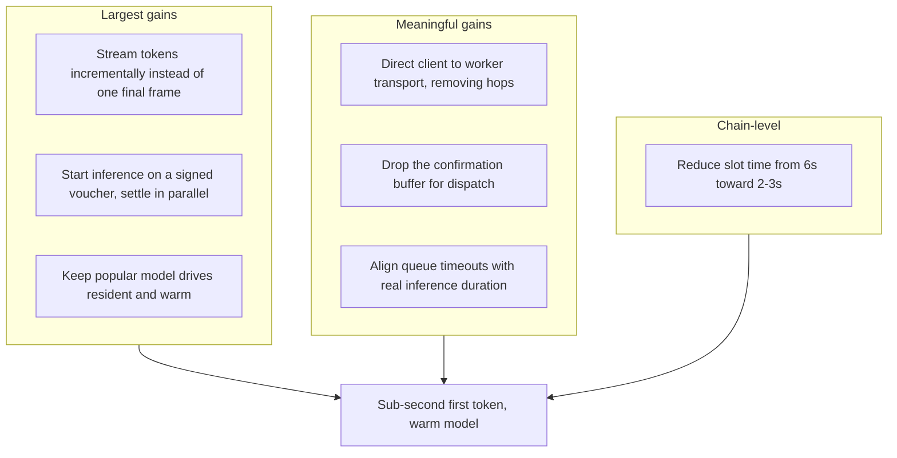

**1. Stream tokens.** The single largest available improvement, and it changes no contract
and no consensus parameter. The runtime supports incremental generation; taking it and
forwarding encrypted chunks as they arrive converts a 1-to-60-second wait into a
first-token latency of roughly the model's own prefill time. Perceived latency improves by
an order of magnitude for long answers. The response blob and on-chain completion still
carry the full response, so settlement and dispute logic are unaffected.

**2. Start inference before settlement confirms.** Today inference begins after several
sequential confirmations. A worker can instead begin on a **signed dispatch voucher** —
the same authorisation it already receives — and let submission, acknowledgement, and blob
posting proceed in parallel with generation. The economics are unchanged because escrow is
still established; only the ordering moves. This removes up to four slot-boundary waits,
worth roughly 6 to 24 seconds at current slot timing.

**3. Keep models warm.** Cold model load is a large fixed cost. Because Advancement 1 makes
models addressable and pre-fetchable, a supervisor can hold advertised drives resident, so
a job for a popular model starts generating immediately.

**4. Direct transport.** Removing the intermediary hops between client and worker takes out
two network round trips each way and makes token streaming a direct stream rather than a
relayed one.

**5. Drop the confirmation buffer.** Dispatch currently waits an extra block for
confirmation. That buffer protects against shallow reorganisations; for a job that is
economically bounded by escrow and a dispute window, it can be reduced to zero and the risk
absorbed by existing mechanisms.

**6. Align timeouts.** The queue timeout should exceed the maximum inference duration, so
long generations are never abandoned and retried, which is a tail-latency problem rather
than a median one.

### 11.3 Can block time be reduced?

Yes, and it is worth doing, but it should be understood as a second-order improvement for
chat.

The chain is configured for 6-second slots, already faster than the 12-second Ethereum
default the client software ships with. Moving to 2 or 3 seconds is technically
straightforward and operationally demanding:

- `SECONDS_PER_SLOT` and `SLOTS_PER_EPOCH` are consensus parameters. Every beacon node and
  every validator must load the same values, so this is a coordinated network upgrade, not
  a configuration tweak. Partial adoption produces missed attestations and a chain split.
- Everything denominated in wall-clock time must be recalibrated together: governance
  voting windows expressed in blocks, dispute and resolution windows, blob retention, and
  worker-side transaction timeouts.
- Shorter slots increase orphan rate and bandwidth per validator, so the floor is set by
  network propagation rather than by preference.

The honest assessment: at 3-second slots, the confirmation waits in the table above roughly
halve. But if streaming and parallel settlement are implemented first, those waits are
largely removed from the user-visible path anyway, and the remaining benefit is faster
settlement rather than faster answers.

**Recommendation:** treat the slot-time reduction as a separate proposal on its own merits —
faster settlement, faster finality, better user experience for transfers and governance —
rather than as a chat-latency measure. Implement streaming and parallel settlement first,
because they are cheaper, safer, and larger.

### 11.4 What good looks like

| Measure | Today | With streaming and parallel settlement | Also with 3s slots |
| --- | --- | --- | --- |
| Time to first token, warm model | Full generation, 1-60s | Prefill only, well under 1s | Unchanged, already off the path |
| Time to first token, cold model | Full generation plus load | Load plus prefill | Unchanged |
| Time to complete answer | 1-60s | Roughly unchanged | Unchanged |
| Confirmations before inference | Up to four slots | Zero on the visible path | Zero |
| Settlement finality | 36-108s | Unchanged | Roughly halved |

The prize is time-to-first-token under a second for a warm model, and it is reachable
without touching consensus at all.

---

## 12. Timeline

Estimates include design, implementation, testing, and documentation.

| Phase | Advancement | Effort | Team | Calendar |
| --- | --- | --- | --- | --- |
| 0 | Design, spikes, blind-peer bootstrap | 4 engineer-weeks | 1 | Weeks 1-4 |
| 1 | Open model delivery | 18 engineer-weeks | 2 | Weeks 3-16 |
| 1b | Streaming and parallel settlement | 10 engineer-weeks | 2 | Weeks 5-12 |
| 2 | Worker supervisor and OTA | 26 engineer-weeks | 2 | Weeks 6-22 |
| 3 | Artifact availability | 18 engineer-weeks | 2 | Weeks 14-26 |
| 4 | Universal peer-to-peer hub | 66 engineer-weeks | 3 | Weeks 22-48 |
| 5 | Direct peer routing, prototype | 20 engineer-weeks | 2 | Weeks 28-44 |

Phase 1b is separated because it is the highest-value work in the paper relative to its
size, it depends on nothing else, and it can ship before anything peer-to-peer exists.

Phases 0 through 4 total roughly **142 engineer-weeks over about eleven months**, peaking
at four to five engineers mid-schedule.

<!-- caption: Indicative schedule across phases 0 to 5, assuming a September 2026 start -->
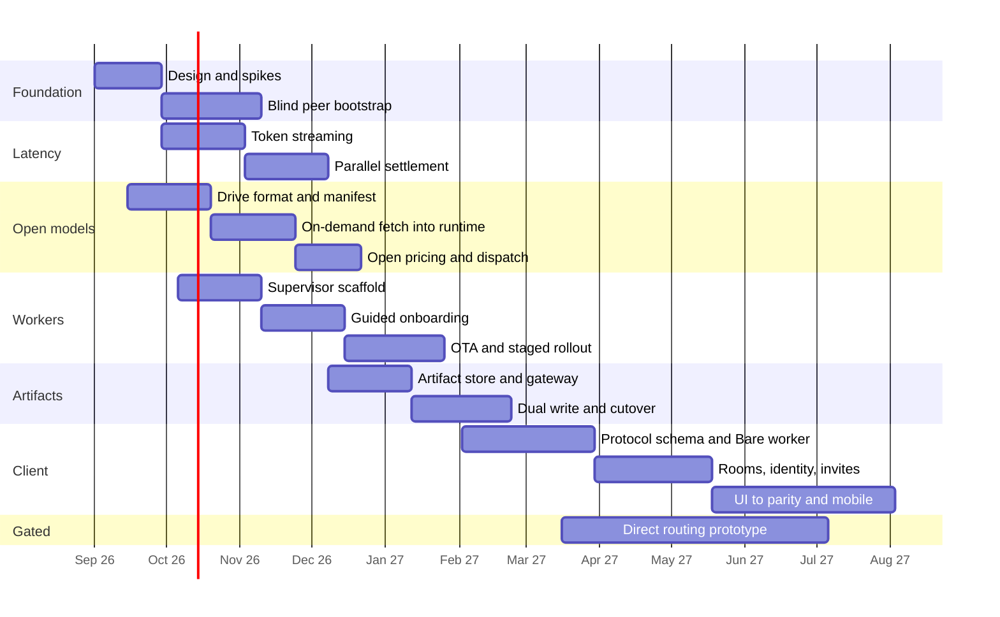

### Dependencies and gates

<!-- caption: Phase dependencies and the DAO checkpoint -->
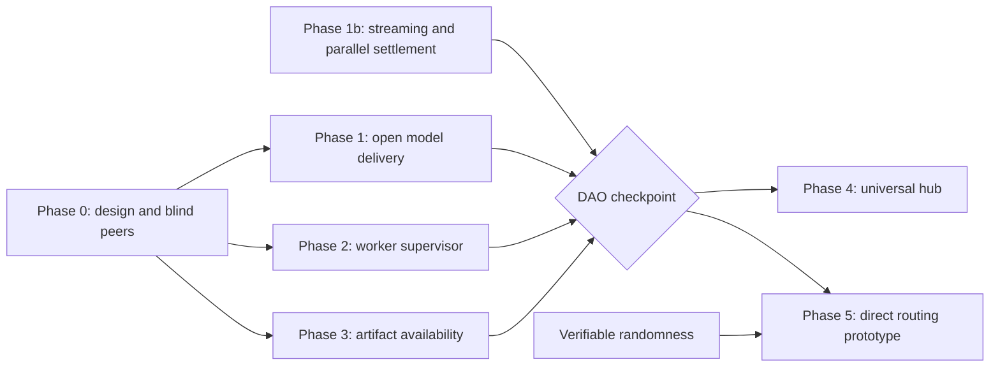

Phases 1, 1b, 2 and 3 are independent of one another. The checkpoint before Phase 4 is a
real gate: the chat client's history guarantees depend on blind-peer retention having been
measured in production first.

Dates assume a September 2026 start and are illustrative. What the DAO approves is the
ordering, the gates, and the sequence.

---

## 13. Risk register

- **Availability is the recurring risk.** Peer-to-peer retrieval requires a live source.
  Blind peers are the answer, and their reliability must be engineered and monitored rather
  than assumed.
- **The release key becomes critical infrastructure** the moment workers auto-update.
  Multisig control and staged rollout are mandatory.
- **Append-only data is permanent.** Schema decisions in Phases 3 and 4 cannot be migrated
  later, so evolution must be additive-only from the first commit.
- **Open model publication shifts curation to the edges.** Discovery, reputation, and
  operator-side filtering must exist before the catalogue is opened widely.
- **Fee-class inference must be verifiable**, or open pricing can be gamed.
- **A slot-time change is a coordinated network upgrade** and must not be bundled with
  application work.
- **Team capacity.** Four to five engineers over eleven months is a real commitment, and
  Phase 4 warrants dedicated staffing.

---

## 14. Alternatives considered

- **A CDN for model weights.** Simpler and faster on cold start, but it reintroduces a
  central dependency, gives no verification of what was served, and its cost grows with
  every new operator.
- **Keeping a curated model list and expanding it faster.** Lower risk, but it keeps
  catalogue growth bounded by administrative throughput rather than by demand.
- **Self-hosting the current artifact pinning stack.** Removes the vendor but keeps the
  operational burden, and still lacks signed-log verifiability and NAT traversal.
- **A dedicated data-availability layer such as Celestia.** Designed for consensus-critical
  DA with sampling, a different problem from serving multi-gigabyte weights. Not mutually
  exclusive with this paper.
- **Reducing block time alone to improve chat.** Analysed in Section 11 and rejected as the
  primary lever, because streaming and parallel settlement deliver a much larger
  improvement at a fraction of the risk.
- **Replacing consensus gossip with HyperDHT.** Rejected. Destabilises consensus networking
  for modest gain, and is distinct from Advancement 5, which concerns routing rather than
  consensus.

---

## 15. Success metrics

- Time to first token for a warm model, measured at the client
- Share of jobs served by a worker that acquired the model on demand
- Number of distinct models callable, and the share published by non-administrators
- Share of workers obtaining weights peer-to-peer rather than manually
- Time from a new operator's first download to their first completed job
- Worker count and the share running current software
- Artifact retrievability with the publisher offline across a full challenge window
- Hub active users per platform, and message delivery success rate

---

## 16. What the DAO is voting on

- **Vote 1:** Adopt Hyperdrive as the model distribution layer and approve permissionless
  model publication with class-based default pricing, replacing the approved-model list.
- **Vote 2:** Approve incremental token streaming and parallel settlement as a priority
  latency programme.
- **Vote 3:** Approve the worker supervisor with over-the-air updates, subject to a
  multisig release-signing policy returned to the DAO before first release.
- **Vote 4:** Approve moving artifact storage to Hypercore with a DAO-operated bootstrap
  set of blind peers and a defined path to third-party operation.
- **Vote 5:** Approve the universal peer-to-peer hub in principle, gated on the checkpoint and on a
  resolved moderation policy.
- **Vote 6:** Commission a design document and testnet prototype for direct peer routing,
  with no mainnet commitment.
- **Vote 7:** Confirm that consensus rules, EVM execution, blob data availability, and
  token economics are out of scope and require separate proposals. Any slot-time change
  comes back as its own proposal.

---

## 17. Open questions for the community

1. Who sets the default fee curve for open models, and how often is it revisited?
2. Should model publishers receive a share of the fees their models earn, and if so from
   which part of the existing split?
3. Should worker auto-update be opt-out or opt-in, and who holds the release multisig?
4. Who operates the bootstrap blind peers, and how do we transition to permissionless
   operation?
5. What is the moderation policy for a chat product where no operator can read or remove
   content, and what is the equivalent policy for openly published models?
6. Should the Ethereum-mainnet subscription product be unified with per-job settlement?
7. Should a slot-time reduction be pursued on its own merits, separate from this paper?

---

## 18. Recommendation

Adopt Votes 1, 2, 3 and 7, and begin Phases 0, 1, 1b and 2.

Phase 1b — streaming and parallel settlement — should start immediately. It is the smallest
piece of work in this paper and the largest user-visible improvement, it depends on nothing
else, and it needs no new infrastructure.

Advancement 1 is the strategic centre of the paper. Making models addressable by key
simultaneously solves distribution, verification, and the approved-list bottleneck, and it
is what lets a user call any model at all. Advancement 2 compounds it, because a supervisor
that can hold model drives warm is what makes open model serving fast rather than merely
possible.

Approve Vote 4 alongside a concrete blind-peer operations plan with retention targets.

Approve Vote 5 in principle but hold the client behind the checkpoint, because it is the
work where an unforced error is most publicly visible and it depends on availability
guarantees that will not be proven until Phase 3 has run in production.

Approve Vote 6 as a design exercise. Direct peer routing is the most complete answer to how
decentralized this network is, and it deserves a document and a prototype before it
deserves a migration.
