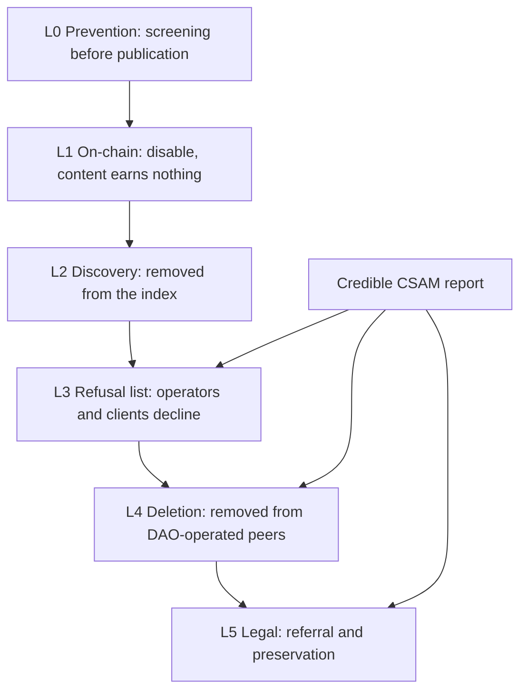

<!-- cover
eyebrow: Lightchain AI DAO · Governance Proposal
title: A <grad>Safety Framework</grad> for the Peer-to-Peer Network
lede: Establishing how Lightchain refuses, removes, and reports illegal material — with authority that is narrow, auditable, and impossible to use quietly.
runner: Proposal · Safety Framework
note: Sections 1 to 3 set out the problem and the honest limits. Sections 4 to 7 are the mechanism and who holds authority over it. Section 8 answers the censorship objection directly. Sections 9 onward cover accountability, the votes, and the open questions.
-->

# A Safety Framework for the Peer-to-Peer Network

**Status:** Draft for community discussion and DAO vote
**Companion proposal:** Lightchain AI: A Peer-to-Peer Infrastructure Layer
**Technical detail:** Amendment — Removing Illegal Content From a Peer-to-Peer Network
**Explicitly out of scope:** Consensus, tokenomics, the block-time proposal

---

## 1. Executive summary

The peer-to-peer proposal asks the DAO to let anyone publish a model and to ship a chat client
where no operator can read conversations. Both are good for the protocol. Both also mean the
network will, eventually, be asked to carry something illegal.

This proposal establishes what happens then.

It creates one shared, public, append-only list of refused content, which every peer, worker,
and client independently declines to store, serve, or execute. It defines who may add to that
list, under what categories, with what quorum, and how a mistake is corrected. And it states
plainly what the network cannot do, so that nobody — the community, a partner, or a regulator
— is misled about the guarantee on offer.

The design has one property that matters more than any other: **the authority it creates
cannot be used quietly.** Every entry is permanently visible, categorised, and signed. If a
future council tried to widen this from illegal material to inconvenient material, the
evidence would be public and permanent the moment they did it.

This is a separate proposal from the infrastructure work because it is a separate decision. A
community can reasonably want peer-to-peer infrastructure and reasonably disagree about who
should hold takedown authority.

---

## 2. Why this needs to exist before launch

Three of the five advancements in the companion proposal change our exposure:

**Open model publication** means the catalogue is no longer curated by an administrator. That
is the point of it, and it removes the implicit filter that a gated list provided.

**A peer-to-peer chat client** means conversation history lives with participants and no
operator can read it. Also the point, and it removes the possibility of server-side review.

**DAO-operated blind peers** mean the DAO itself becomes an infrastructure operator, holding
and serving other people's data. That is a different legal position from writing software.

None of this is an argument against the work. It is an argument for shipping the answer at the
same time as the capability, rather than improvising under pressure later.

---

## 3. What the network can and cannot do

The most important section in this proposal, and the one most likely to be skipped.

### Cannot

**We cannot erase data from the network.** Once a content key is known and any peer holds the
data, replication cannot be cancelled remotely. This is not a gap in our implementation; it is
what peer-to-peer means. Any protocol claiming guaranteed deletion is either mistaken or is
not peer-to-peer.

**We cannot scan encrypted conversations.** Blind peers hold ciphertext by design. Scanning
would require holding decryption keys, which would destroy the exact property that makes the
chat client worth shipping. We will not do it and will not claim to.

**We cannot prove a third party deleted anything.** No attestation mechanism exists.

### Can

**We can make material unreachable through every surface the protocol touches** — every
client, every worker, every seeder, and every peer that honours the list.

**We can remove it from every machine the DAO operates**, which is where always-on
availability actually comes from.

**We can make it worthless**, by disabling it on-chain so no job can be created and no fee can
be earned.

### What that adds up to

For material that depends on always-on infrastructure, the practical difference between this
and deletion is small. For material a determined party keeps seeding privately, we can stop it
being reachable through Lightchain, and nothing more. That is the honest boundary and this
proposal does not pretend otherwise.

---

## 4. The response ladder

Six rungs, least invasive first. Each is independently auditable, and CSAM enters near the
bottom immediately rather than climbing.

<!-- caption: The escalation ladder, with the CSAM fast path entering at the removal rungs -->

One lever already exists. The `disableModel` function in our configuration contract is
implemented and governance-gated today. Because a model's identifier is the same 32-byte key
that retrieves it, disabling on-chain and refusing peer-to-peer address exactly the same
thing.

---

## 5. The refusal list

A single public list of refused content keys, published as an append-only log that anyone can
read and verify.

Each entry carries a category, a timestamp, a case reference, and the signatures that
authorised it. Entries carry **no description and no hash of the material**, so the list can
never be used to find what it protects against.

Participants subscribe and enforce independently. There is no central server, no takedown
API, and no ability to reach into a machine the DAO does not operate.

### Pros

- **Auditable by construction.** Append-only and public means every act of authority is
  permanently visible, including any attempt to widen its scope.
- **Effective where it matters.** Most illegal material depends on always-on availability. The
  list plus DAO-operated deletion removes exactly that.
- **Proportionate.** Six rungs mean the mildest effective response is used first, and using a
  strong rung is itself a visible act.
- **Preserves the architecture.** No scanning, no key escrow, no moderator with read access,
  no change to encryption.
- **Reuses a proven pattern.** The stack already ships a subscribable ban list for network
  addresses; this extends the same shape to content.
- **Correctable.** A wrong entry is revoked by a later entry, and both stay visible forever.

### Cons

- **It creates authority that did not exist.** A small group gains the ability to make content
  unreachable through official surfaces. That is a real transfer of power and should be
  treated as one.
- **It is only as good as the operators who honour it.** Voluntary subscription is what keeps
  it from being a kill switch, and it is also what limits its reach.
- **It does not achieve deletion.** Determined private seeding survives it.
- **It adds an ongoing obligation.** Reports must be triaged by people, promptly, forever.
- **Detection is limited.** Screening only works on unencrypted published artifacts, and
  industry hash sets require vetted access we do not yet have.

### Risks and mitigations

- *Scope creep from illegal material to disfavoured material* → categories are narrow and
  published; anything beyond `csam` and `illegal-per-se` is opt-in per subscriber; every entry
  is permanently public.
- *Capture of the signer set* → staggered terms, a required independent member, and DAO power
  to remove any signer.
- *Abuse of the emergency path* → single-signer entries are limited to CSAM and expire in 72
  hours unless ratified by quorum.
- *Wrongful takedown* → published appeal route, revocation by superseding entry, and a
  permanent public record of the error.
- *Under-response* → published triage deadlines and a periodic accountability report.

### Acceptance criteria

The list is live and public, three independently operated peers honour it, an entry
demonstrably causes refusal and deletion within a published time bound, a revocation restores
access, and the whole history is readable by any community member without permission.

---

## 6. Who holds the authority

A **Safety Council** of five signers, with a three-of-five quorum to add or revoke an entry.

- Two seats from the core team, two elected by the DAO, one independent seat filled by a
  person with relevant professional background and no other role in the protocol.
- Staggered terms, so the whole council never turns over at once.
- The DAO may remove any signer by ordinary vote, at any time, without cause.
- A signer with any interest in the content in question recuses.
- The council publishes an accountability report on a fixed schedule. Because the list is
  append-only and public, the report explains decisions rather than disclosing them.

**Emergency authority.** Any single signer may add a `csam` entry immediately, without waiting
for quorum. That entry expires automatically after 72 hours unless three signers ratify it.
This is the only unilateral power in the framework, it is limited to one category, and it
fails safe.

---

## 7. CSAM specifically

This is the case the framework exists for, and it is handled differently from everything else.

On a credible report: an emergency entry is added immediately, every peer the DAO operates
drops the content and stops announcing it, any associated model is disabled on-chain, and a
referral is made to the appropriate authority with whatever preservation is legally required.
Ratification follows within 72 hours or the entry lapses.

**No member of the council or the team views suspected material to verify it.** Verification
belongs to the reporting pipeline and to law enforcement. This protects both the integrity of
the process and the people running it.

Detection at publication uses industry hash matching where we can obtain access. Those hash
sets are not public and require vetted status, which is an open item in Section 11.

---

## 8. The censorship objection, answered directly

The strongest argument against this proposal is that a decentralized network should have no
takedown mechanism at all, because any mechanism will eventually be pointed at speech someone
in authority dislikes. That argument deserves a real answer rather than reassurance.

Four properties make this framework structurally different from a moderation backdoor:

**It cannot be used quietly.** The list is append-only and public. There is no private
takedown channel, no unlogged path, and no way to remove the evidence of an entry. Widening
the scope is not something that can be done and denied.

**It is voluntary.** Honouring the list is each operator's choice. An operator who refuses
remains a full participant in the network and carries their own legal exposure. The DAO gains
no power to compel anyone.

**It is narrow by default.** Two categories are expected to be honoured universally, both
defined by content that is illegal to possess regardless of context. Everything else is opt-in
and must be argued for separately, in public.

**It fails safe.** The only unilateral power expires by default. Inaction lets an entry lapse;
it does not let one persist.

What this framework does not do is pretend the tension away. It creates authority. The
argument is that the alternative — a network with open publication, encrypted rooms,
DAO-operated infrastructure, and no answer for illegal material — is worse for everyone,
including the people most concerned about censorship, because the response to the first
serious incident would then be improvised, opaque, and probably far broader.

---

## 9. Accountability

- Every entry is public, permanently, with its category, timestamp, and signatures.
- A periodic report covering volume by category, response times against the published bounds,
  appeals received, and revocations issued.
- An annual review of the framework by the DAO, including whether the categories remain
  correctly drawn.
- A standing invitation for any community member to audit the list, which requires no
  permission because it is public by design.

---

## 10. What the DAO is voting on

- **Vote 1:** Adopt the Safety Policy defining the categories, the response ladder, the
  authority to act, and the appeal route.
- **Vote 2:** Establish the refusal list as a public, append-only, quorum-governed log, with
  emergency single-signer entries limited to CSAM and expiring in 72 hours.
- **Vote 3:** Constitute the Safety Council as five signers with a three-of-five quorum,
  composed as described in Section 6, removable by ordinary DAO vote.
- **Vote 4:** Make the framework a release gate. Open model publication and the public chat
  client do not ship until the policy is published and the mechanism is proven end to end.
- **Vote 5:** Affirm the limits. The DAO does not claim the ability to erase data from
  independent peers, and will not add scanning, key escrow, or moderator read access to
  encrypted conversations.

Vote 5 is not a formality. It is the commitment that constrains every future council, and it
is the reason the other four votes are safe to pass.

---

## 11. Open questions for the community

1. Is five signers with a three-of-five quorum the right balance, or should the threshold be
   higher for non-emergency entries?
2. Who should fill the independent seat, and how is that person selected?
3. Should any category beyond `csam` and `illegal-per-se` be honoured by default, or should
   everything else remain strictly opt-in?
4. What response-time bound should the council commit to publicly?
5. Should the DAO seek vetted access to industry hash sets, given that doing so may create
   reporting obligations of its own?
6. Should operators who decline to honour the list be identified publicly, or is that itself a
   form of pressure the framework should avoid?

---

## 12. Recommendation

Adopt all five votes, and treat Vote 5 as the anchor.

The framework is worth adopting because it is the narrowest workable answer to a problem the
companion proposal creates. It gains the protocol a credible response to illegal material
without a scanning backdoor, without key escrow, without a moderator who can read
conversations, and without any claim to power over peers the DAO does not operate.

It should be adopted with clear eyes about the trade. This creates authority that does not
exist today. The case for it is that the authority is narrow, expires by default, is
permanently visible, and is voluntary to honour — and that a network of this shape without
any answer at all is not a defensible position to be in when the first serious report arrives.
